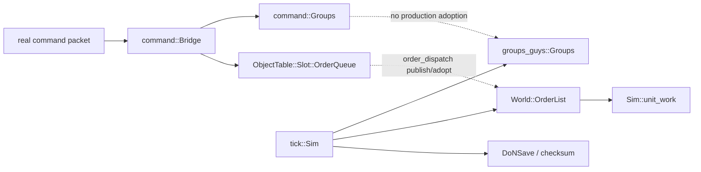

# Movement command closure architecture

Status: audited 2026-08-11. This is an ownership/dependency map, not a closure claim. No
movement opcode or group-action row is promoted by this document or by the DoNSave v12
scalar-order tranche alone.

## The ownership break

The recovered action and executor bodies are not one production path today. They form two
independently tested islands:

`command::Bridge` is a real wire decoder, but no production constructor mounts its private
`command::Groups` into `Sim`. `Sim`, save/load, and checksum own a different
`groups_guys::Groups`. Likewise, command installation first lands in executable
`OrderQueue<OrderRec>`, while production tick/save own `OrderList<Order>`. Before v12, the
only adapter between those order types dropped MoveOrder retry/facing/origin and GroupMove
identity fields. A green Bridge test therefore did not prove a packet could resume in the
production tick.

The canonical end state is one Sim-side transaction keyed by canonical owner and group
slot/id (plus a revision or complete before-image). Bridge decodes a packet into that
request. The transaction preflights every group/member/target/terrain/path/RNG read,
revalidates the complete snapshot, then commits `groups_guys::Groups`, World order queues,
paths, collision sidecars, and RNG together. Bridge must not piecewise mutate a shadow
group or ObjectTable first.

## Exact command/action graph

| Opcode | Group action spine | Installed/executed order families | Shared dependencies before closure |
|---|---|---|---|
| 3 FORM | `action_form` -> `action_halt` / `action_move_to` -> `action_move_near` | `CHANGE_FORM`, `GROUP_MOVE`, `MOVE_TO` | canonical group/member facts; formation destinations; halt transaction; Move payload; path/collision owner |
| 4 ATTACK | `action_attack` -> per-member attack/cast/move split | `ATTACK`, `CAST_SPELL`, `GROUP_ATTACK_TO` / `MOVE_TO` | stable target identity; capability/stance/range facts; attack-position host and RNG; Cast payload; group commit |
| 5 SIEGE | recovered entry prefix -> attack or guard body | `ATTACK`, `GUARD`, move-like approach | exact attack body; Guard payload/host; target identity; group commit |
| 6 SWARM | recovered entry prefix -> halt/move plus build/repair/cast split | `BUILD_AT`, `REPAIR`, `CAST_SPELL`, move-like | economy payloads and typed hosts; formation/movement transaction |
| 7 MOVE_TO | 49-byte forwarder -> `action_move_near` | `MOVE_TO`, `ATTACK_TO`, `EXPLORE_TO`, `FLEE_TO`, `GROUP_MOVE` | full move-near tail; canonical group/order/path/RNG owners |
| 8 MOVE_NEAR | `action_move_near` (9,205 bytes) | same MoveOrder/GroupMove families | selection split; garrison/disembark tail; water pathfinder; formation/group identity; atomic order/path/RNG commit |
| 9 ATTACK_GROUND | coordinate entry -> ground/air installer | `ATTACK_GROUND`, `AIR_ATTACK_GROUND` | typed payload tags 9/10; air physics/fire hosts; target-position and group commit |
| 10 PATROL | `action_patrol` -> ground or air delegate | `GROUP_PATROL`, `AIR_PATROL` | dynamic waypoint payloads tags 7/6; group/air executors; movement transaction |
| 11 LAUNCH_PATROL | air-only patrol delegate | `AIR_PATROL` | containment/home identity; payload tag 6; air executor/physics |
| 31 GUARD | target entry -> `action_guard` | `GUARD`, QueuePos::First move insertion | Guard payload tag 5; `guard_dispatch`; stable identity; same-tick Move owner |
| 36 SCRAMBLE | contained-air traversal -> air patrol install | `AIR_PATROL` | containment chain snapshot; payload tag 6; atomic launch/patrol install |

The opcode graph shares three high-fanout funnels: `action_move_near`, the canonical group
transaction, and the typed per-unit order envelope. Closing those owners is higher leverage
than promoting individual planner bodies in isolation.

## Recovered bodies and their remaining production dependencies

### Move-near, formation, path, and RNG

- `command.rs::Action::action_move_near` contains the active flat/formation installer and
  mounts `group_move_near_split::plan_move_near_split` for the recovered selection split.
- `group_move_near_garrison_disembark_tail.rs` maps the 3,399-byte garrison/disembark and
  path-scatter tail, including reached `astar_path` RNG draws, current-order pause writes,
  the unit `+0xB2` counter, path inversion, and `group.order_num`. It is source-only and is
  not registered in `systems/mod.rs`; it is not part of the production command path.
- `order_dispatch.rs` owns executable `MoveOrder`, `GroupMoveOrder`, `do_group_move`,
  `do_group_attack_to`, parked PathFinder state, retry RNG coupling, and group host receipt
  shapes. Its generic `WorkWorld` test hosts are not a production Sim adapter.
- `movement_live.rs` and `tick.rs::do_move` own the installed collision source and spatial
  commit. The live collision source is not yet reconstructed by DoNSave, so load must never
  invent it. A loaded zero-speed move can resume/hold exactly; spatial movement requires the
  sidecar to be installed from authoritative facts.
- The exact water `find_wpath` provider used by the move-near scatter tail is not mounted in
  production. This is a hard dependency, not permission to substitute the unit A* wrapper.

### Attack split

- `command.rs::Action::action_attack` is still the narrow active split; the full 3,833-byte
  request-to-plan recovery is being kept independent so it can mount into the canonical Sim
  transaction rather than deepen the shadow `command::Groups` owner.
- `attack_position.rs` owns exact candidate scanning and `game_random(0,0xffff)` scoring.
  A production adapter must bind those reads and advance the one canonical Sim RNG only for
  reached calls.
- `order_dispatch.rs::{do_group_attack,do_group_attack_to}` already express coherent host
  snapshots/effects, but require canonical group and target identities. `GROUP_ATTACK` is a
  targeted attack class, not a MoveOrder; `GROUP_ATTACK_TO` is the MoveOrder-derived class.

### Guard, patrol, and air delegates

- `guard_order.rs` and `guard_dispatch.rs` own the exact Guard payload/eleven-branch
  executor, including QueuePos::First move insertion and same-tick move. They still need one
  Sim-backed target/group/path host and typed save tag 5.
- `patrol.rs` owns dynamic ground/air waypoint data. `order_dispatch.rs` owns
  `install_group_patrol`, `install_air_patrol`, `do_patrol`, and `do_air_patrol`. Narrowing
  those nodes through an Order without typed patrol variants remains forbidden.
- launch-patrol and scramble additionally require exact containment/home-chain state and an
  atomic air launch transaction. The existing ObjectTable and test air world are not the
  canonical Sim owner.

## First reusable transaction cohort now landed

`order.rs::MoveOrderState` is the canonical optional payload for all seven measured
MoveOrder-derived kinds: `MOVE_TO`, `ATTACK_TO`, `EXPLORE_TO`, `FLEE_TO`, `CHANGE_FORM`,
`GROUP_MOVE`, and `GROUP_ATTACK_TO`. `order_dispatch::{adopt,publish}` now preserves all 23
scalar fields in both directions. DoNSave v12 appends an explicit `tag:u8,
payload_version:u8` envelope to each legacy order image:

| Tag | v1 contract | v12 behavior now |
|---:|---|---|
| 0 | no payload, version 0 | accepted only for non-Move kinds |
| 1 | `MoveOrderState` scalar image | written/read; foreign kind rejected |
| 2 | GATHER suffix: tx/ty/build_type/wait plus four byte latches | reserved, rejected until typed Order variant |
| 3 | CAST suffix: paid/spell | reserved, rejected until typed Order variant |
| 4 | TRADE second identity and started/loaded history | reserved, rejected until typed Order variant |
| 5 | `GuardOrderState` | reserved, rejected until typed Order variant |
| 6 | `AirPatrolOrder` | reserved, rejected until typed Order variant |
| 7 | `GroupPatrolOrder` | reserved, rejected until typed Order variant |
| 8 | `StrafeOrder` | reserved, rejected until typed Order variant |
| 9 | `AttackGroundOrderState` | reserved, rejected until typed Order variant |
| 10 | `AirAttackGroundOrderState` | reserved, rejected until typed Order variant |

Each tag has an independent payload version, so adding an already-proven typed variant does
not require DoNSave v13. Unknown tags/versions and payloads attached to foreign order kinds
fail closed. Versions 7 through 11 retain the byte-identical legacy order image and read
with `move_state == None`; they are never silently upgraded during decode. A legacy save
with an active Move kind remains inspectable but cannot be laundered into v12 or executed as
authoritative state until its missing fields have a real source. Legacy non-Move streams
still upgrade normally.

Evidence in `movement_order_save_resume.rs` uses actual group + MOVE_TO wire packets, mutates
every executable movement scalar, publishes the executable queue into the tick-owned World,
saves/reloads, executes a production frame, and saves/reloads again. The save codec also has
one mutation-sensitive case per field and failure-before-write/read tests for foreign,
unknown-version, unknown-tag, and truncated payloads.

## Converge-forward cohorts

1. **Canonical Sim group command host.** Introduce one request/plan/commit seam over
   `groups_guys::Groups` and World orders. Adopt group selection and revisions into it; turn
   Bridge into a decoder/client. This is prerequisite for every row in the table.
2. **Move/form cohort.** Mount the full move-near tail, exact water path provider, formation
   facts, paths, collision state, RNG, and MoveOrder commit into the canonical host. This can
   close opcodes 3, 7, and 8 together and supplies the movement leg used elsewhere.
3. **Attack/guard cohort.** Mount the full attack split, stable target identities,
   attack-position provider, Guard payload/host, and attack executors. This joins opcodes 4,
   5, and 31 plus the attack branches of 6/10.
4. **Patrol/air cohort.** Land typed payloads 5--10, then mount containment, dynamic
   waypoints, air search/physics, and atomic launch/return effects. This joins opcodes 9, 10,
   11, and 36.

No cohort may promote a row without real packet evidence, failure-before-mutation rollback,
per-field mutation sensitivity, deterministic save/reload/resume, and a production Sim host
for every reached dependency.
