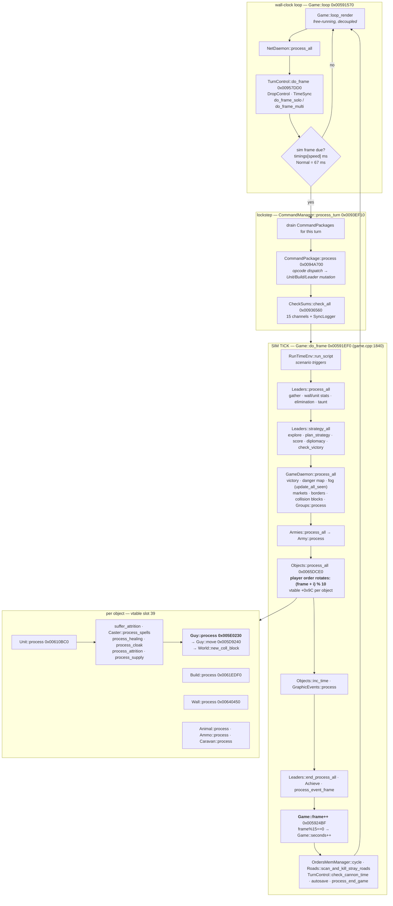

# The simulation architecture, from the shipped PDB

**What changed.** `ron-bin/sbl/rise.pdb` — 57 MB, GUID `{51D4F219-61C6-4F84-9D5B-C3361B0D291F}` age 1,
matching the CodeView record in `riseofnations.exe` — ships with the game. It is **not stripped**,
it carries **full DBI line information**, and that means every function in the retail binary comes
with the **original source filename and line number** it was compiled from. We are no longer
reading a stripped binary. We are reading Big Huge Games' source tree with the bodies replaced by
x86.

This document is the map Ember asked for: *a big sight onto the simulation architecture*. It
covers the recovered source tree, the main tick and its exact subsystem ordering, the real unit
pathfinder, the command/order path, and the simulation/presentation boundary. Where the PDB
contradicts something already written down in `docs/derivation/*.md`, it says so loudly in §8 —
those corrections are the most valuable part of the document.

Companion documents, produced by parallel lanes on the same PDB: `docs/derivation/pdb-types.md`
(class layouts, `sizeof`, field offsets from the TPI stream) and
`docs/tooling/ledger-reconciliation.md`. This one is the **control-flow and module** map; that one
is the **data** map. Read both.

---

## 0. Provenance and method

Everything below is `[measured]` on this Mac against `ron-bin/riseofnations.exe`
(sha256 `30478a44…625079`, PE32 i386, image base `0x00400000`) and `ron-bin/sbl/rise.pdb`, unless
explicitly marked `[reported]`.

The extractor is ~60 lines of Rust over the `pdb` crate (willglynn), walking every DBI module,
taking every `S_GPROC32`/`S_LPROC32`/`S_THUNK32`, converting the section offset to an RVA through
the address map, and pairing it with the **lowest-offset line record for that procedure** — which
is the line of its opening brace.

```
va  size  module(.obj)  srcfile  line  name
0068a030   128   …/game/PathFinder.obj   …/main/game/pathfinder.cpp   4143   PathFinder::PathFinder
```

**22,701 procedures** across **391 modules with debug info** (778 DBI modules total; the rest are
import libraries with no symbol stream). Cross-checked against `schema/rise-symbols.tsv`: the
procedure set covers **20,384 distinct `.text` VAs** and is a superset of the 17,942 `.text`
publics, missing only **30**. Coverage of authored code is effectively complete.

Three derived tools, all in the session scratchpad, all reproducible in a minute:

| tool | does |
|---|---|
| `funcs.tsv` | the table above |
| `byfile.py <path-fragment>` | every function in a source file **ordered by source line** — reconstructs the original file layout |
| `calls.py <va>` | disassembles a function and prints its **direct calls in address order**, each symbolised with `name [srcfile:line]` |
| `xref.py <va>` | reverse call graph over all 22,701 functions |
| `vtdump2.py <va> <n>` | dumps a vtable, symbolising each slot |

`calls.py` is the one that mattered. Reading a function's ordered call list, with every callee
named and located in a source file, is how the tick ordering in §3 was recovered — it took one
command.

**One caveat that will bite anyone using the symbol table naively.** MSVC identical-COMDAT-folding
merges every empty method body. `0x0041bff0` is a single `xor eax,eax; ret` shared by ~70 distinct
names (`UnitOrder::is_move`, `UnitOrder::get_move_order`, `Window::get_button`, …). A VA→name map
built from publics will hand you an arbitrary one of them. Always check the size: a 3-byte or
8-byte function is a folded stub, not the thing you were looking for.

---

## 1. The source tree

### 1.1 Roots

The build machine was `E:\agent\_work\2\s\main\` — an Azure DevOps agent workspace, consistent
with the 2024 MSVC-14 rebuild. Four first-party roots:

| root | functions | code bytes | what it is |
|---|---:|---:|---|
| `main/game/` | 12,425 | 5,207,950 | **Rise of Nations itself** — simulation, rules, UI, scenario, Conquer-the-World |
| `main/basic/` | 4,463 | 668,749 | BHG's foundation library — containers, `String`, `Random`, math, Steam/lobby glue |
| `main/bighuge/` | 1,774 | 320,412 | the BHG engine — window/event framework, buffers, image IO, animation manager, profiler |
| `main/pnglib/` `main/zlib/` | 195 | 85,765 | vendored third-party |

Plus MSVC CRT/STL headers (3,052 functions), `cpprestsdk`, the Steamworks SDK, `cellsdk`,
`cpclib`, `crossplaynetlib`.

**903 distinct first-party source files**, of which **606 under `game/`** (373 of them `.cpp`),
113 under `basic/`, 120 under `bighuge/`.

### 1.2 The naming convention is the architecture

Big Huge Games used a rigid three-way class split, and it is the single most useful structural
fact in the whole PDB:

| suffix | means | example |
|---|---|---|
| `XData` | **POD simulation state + pure queries.** No mutation, no rendering. | `UnitData::attack()`, `WorldData::is_seen()` |
| `X` | **simulation behaviour.** Mutates state, advances the tick. | `Unit::process()`, `Unit::fight()` |
| `XOut` | **presentation.** Draw, sort, HUD, options menus. | `UnitOut::draw()`, `ObjectsOut::sort_all()` |
| `XType` / `XTypeData` | **static rule data** loaded from `ron-data/*.xml` | `UnitType`, `BuildTypeData::calc_gather()` |

Within `main/game/`: 987 `*Data::` methods (314 KB), 460 `*Out::` methods (343 KB), 249 `*Type::`
methods (96 KB), 1,583 window/HUD/render methods (950 KB), and 7,656 plain-class methods (3.35 MB).

**The consequence for the port is sharp: the cut line is the class prefix, not the file.**
`unit.cpp` is 236 KB and contains both `Unit::fight` and 19 KB of `UnitOut::draw_underlays`. There
is no such thing as a "sim file"; there are sim *classes* interleaved with presentation classes in
the same translation unit. Any plan that says "port `unit.cpp`" is wrong by about 20%.

### 1.3 The top 40 source files

Function counts and total code bytes from the PDB; `max line` is the highest source line seen in
that file, a lower bound on its true length. Descriptions are from reading the function names in
each file, not from the filename.

| # | file | funcs | bytes | max line | what it is |
|---:|---|---:|---:|---:|---|
| 1 | `game/scriptfunctions.cpp` | 843 | 134,025 | 20,082 | `ScenarioFuncSet::*` — the ~800 trigger-script builtins the campaign/scenario system exposes. The scripted-AI and scenario action vocabulary. |
| 2 | `game/orders.h` | 685 | 33,217 | 2,566 | The **entire Order class hierarchy**, defined inline in the header. 60 `walk_data` methods, one per order type. This is the action space. |
| 3 | `basic/array.h` | 538 | 79,513 | 618 | `Array<T>` template instantiations. 17 distinct `walk_data`. |
| 4 | `basic/objectarray.h` | 431 | 72,807 | 535 | `ObjectArray<T>` — arrays of non-POD with ctor/dtor. |
| 5 | `basic/arraybase.h` | 366 | 53,640 | 324 | Array growth/copy primitives (`increase_size`). |
| 6 | `game/leaders.cpp` | 331 | 217,595 | 29,172 | **The player record.** Tech tree, upgrades, resource caps, market prices, diplomacy, and the entire production/strategy AI. Contains the largest function in the game. |
| 7 | `game/game.cpp` | 279 | 84,407 | 9,443 | The `Game` singleton: init/teardown, mode dispatch (`run_solo`/`run_scenario`/`run_editor`/`run_playback`), victory checks, and **`Game::do_frame` — the tick**. |
| 8 | `game/unit.cpp` | 273 | 236,417 | 29,899 | **The unit.** Stats, orders, movement, collision, combat, aircraft physics, the `think_*` unit AI, the `do_*` order executors, and `Unit::process`. |
| 9 | `bighuge/window.h` | 264 | 7,567 | 2,708 | 264 empty virtual `on_*` event stubs (all COMDAT-folded). |
| 10 | `basic/linklist.h` | 254 | 30,720 | 947 | `LinkList` / `PtrLinkList`. |
| 11 | `basic/basecolors.cpp` | 232 | 1,508 | 158 | 232 dynamic initializers for named `Color` globals. Nothing else. |
| 12 | `game/gameaccess.cpp` | 207 | 8,789 | 515 | **The global root set** — 200 dynamic-init/atexit pairs binding `GameAccess::*` references. See §2. |
| 13 | `basic/str.cpp` | 198 | 36,481 | 5,508 | `String` — including `String::fraction`, the rules.xml value tokenizer. |
| 14 | `game/graphicpieces.cpp` | 182 | 171,469 | 11,522 | Art binding: unit/building/ammo → mesh, particle, animation. Pure presentation, and one of the largest files. |
| 15 | `game/groups.cpp` | 153 | 107,049 | 12,529 | Formation and group state: `compute_form`, `update_positions`, `action_*` group commands. |
| 16 | `basic/recycler.h` | 153 | 20,882 | 110 | Free-list object pools. `Recycler<T>::temp_pool` statics. |
| 17 | `game/gamespy.cpp` | 150 | 46,846 | 7,945 | Matchmaking/lobby backend, now Steam-backed behind the GameSpy API shape. |
| 18 | `basic/namedarray.h` | 144 | 20,667 | 717 | Name-keyed arrays (rules lookup). |
| 19 | `basic/steam.h` | 140 | 8,856 | 496 | Steam lobby key/value plumbing. |
| 20 | `bighuge/window.cpp` | 135 | 33,754 | 4,430 | Window/z-order/focus/event framework. |
| 21 | `bighuge/profile.h` | 132 | 11,549 | 463 | The section profiler (`profile_init` statics). |
| 22 | `basic/simplearray.h` | 131 | 22,914 | 850 | POD arrays with `walk_data`. |
| 23 | `game/nuke.cpp` | 130 | 34,543 | 2,261 | Nuke **visual FX** — mushroom stalk, dust ring, scorch. `Nuke::do_damage` is the only sim function in it. |
| 24 | `basic/ptrarray.h` | 124 | 26,558 | 369 | `PtrArray<T>` — 11 `walk_data`, including `PtrArray<Guy>` (garrison contents). |
| 25 | `basic/stack.h` | 122 | 12,979 | 287 | `Stack<T>` — notably `Stack<PathData>`, the pathfinder's output buffer, which is checksummed. |
| 26 | `game/setupwin.cpp` | 122 | 112,152 | 10,334 | Pre-game lobby / slot / ranked UI. |
| 27 | `game/map.cpp` | 108 | 95,484 | 9,101 | **Map generation.** `MapWarringStates::make_continents`, `place_player_resource`, river lists, resource divvying. Per-map-style subclasses. |
| 28 | `game/world.cpp` | 102 | 33,994 | 4,367 | **The tile world.** Terrain/fog/territory queries and mutators, `compute_reg_territory`, `reveal_fog`, `analyze_map`. |
| 29 | `game/miscaccess.cpp` | 100 | 4,709 | 291 | The **presentation/session** root set — `MiscAccess::*`. See §2. |
| 30 | `game/conquestwin.cpp` | 98 | 66,455 | 6,532 | Conquer-the-World campaign map screen. |
| 31 | `game/commandpackage.cpp` | 97 | 38,796 | 2,793 | **The lockstep wire unit.** `CommandPackage::process` dispatches every command opcode. |
| 32 | `game/basicrendermethods.h` | 92 | 8,789 | 406 | Render method vtable boilerplate. |
| 33 | `game/terrainout2.cpp` | 89 | 62,438 | 10,943 | Water/coast/road mesh generation, crater deformation. Presentation. |
| 34 | `game/scenarioeditor.cpp` | 89 | 48,446 | 5,437 | The scenario editor. |
| 35 | `game/chataction.h` | 85 | 8,121 | 380 | Chat slash-command action classes. |
| 36 | `game/scenariodata.cpp` | 84 | 13,603 | 681 | Scenario state — objectives, reveal points, queued orders. Is a checksum channel. |
| 37 | `game/build.cpp` | 81 | 73,513 | 7,839 | **The building.** Production queue, gather points, garrison, plunder, `Build::process`. |
| 38 | `game/commandmanager.cpp` | 81 | 18,902 | 2,622 | **The command layer.** ~70 `issue_*` methods + `process_turn`. See §5. |
| 39 | `game/options.cpp` | 78 | 87,264 | 11,435 | Per-player gameplay options **and** the hotkey command dispatchers (`do_repair`, `do_halt`, `do_cycle_military`). Half sim, half UI. |
| 40 | `game/object.cpp` | 77 | 65,204 | 7,513 | **The combat core.** `ObjectData::get_damage`, `Object::do_damage`, `take_damage`, `find_nearby_target`, `do_launch`. |

Honourable mentions just outside the top 40, all sim-critical: `game/terrainout.cpp` (77, 81 KB,
presentation), `game/conquestleaders.cpp` (74), `game/borders.cpp` (73, presentation only),
`game/objects.cpp` (72, the object registry and spatial query layer), `game/buildtype.cpp` (71,
building rules), `game/worldmap.cpp` (71, minimap), `game/conquestgame.cpp` (69),
`game/checksums.cpp` (56, the desync channel list), `game/pathfinder.cpp` (47, 29 KB),
`game/terrain.cpp` (47), `game/roads.cpp` (41), `game/orders.cpp` (41),
`game/turncontrol.cpp` (33, the lockstep clock), `game/constants.cpp` (5 functions, 90 KB — see §8).

---

## 2. The global root set: `GameAccess` vs `MiscAccess`

`gameaccess.cpp` and `miscaccess.cpp` do nothing but define references to global singletons. The
two namespaces are the authors' own top-level partition of the program, and the PDB hands us the
whole list with names.

```
0x00C0617C  GameAccess::conquest_game : ConquestGame&
0x00C06180  GameAccess::turn_control  : TurnControl&
0x00C06184  GameAccess::game_random   : Random&        <-- see §8.1
0x00C06188  GameAccess::world         : World&
0x00C0618C  GameAccess::objects       : Objects&
0x00C06198  GameAccess::obj_base      : int*
0x00C0619C… GameAccess::{bonustypes,govtypes,itemtypes,spelltypes,goodtypes,techtypes} : PtrArray<*Type>&
0x00C061B4  GameAccess::leader_options
0x00C061B8  GameAccess::regions
0x00C061BC  GameAccess::game_daemon   : GameDaemon&
0x00C061C0  GameAccess::ai_speed      : int&
0x00C061C4  GameAccess::ai_off        : int&
0x00C061EC  GameAccess::game          : Game&
0x00C061F0  GameAccess::constants     : Constants&
0x00C061F4… GameAccess::{buildtypes,objecttypes,unittypes}
0x00AD0424… GameAccess::{achieve,searcher,graphic_events,mountains,units,hotkey_groups,groups,
             pathfinder,tribes,nuke_effect,farms,leaders,caravans,lands,oil_wells,supplies,docks,
             wonders,forts,herds,specials,heroes,goods,items,team_colors,forms,unbuilt_*,cities,
             collcheck,armies,setup} + 34 Categories (game rules/settings enumerations)
```

**102 `GameAccess::` members, 66 `GameAccessConst::` members** — the latter are `const` aliases of
the same objects. That immediately explains a standing observation:

> README-LLM: "**RULES**: `[0x00C061E4]` and `[0x00C061F0]` **alias the same object** (live-read)."

Correct, and now explained: `[0x00C061F0]` is `GameAccess::constants : Constants&` and
`[0x00C061E4]` is `GameAccessConst::constantsc : const Constants&`. Same object, two references,
one mutable and one not. The same pattern holds for `world`/`worldc`, `objects`/`objectsc`,
`pathfinder`/`pathfinderc`, and 60-odd more. This is not aliasing to be explained away; it is a
deliberate const-correctness facade.

`MiscAccess` (55 members) holds `camera`, `options`, `message_win`, `scene`, `console`,
`graphic_pieces`, `terrain`, `borders`, `roads`, `rivers`, `cliffs`, `mouseover`, `cursors`,
`worldmap`, `top_menu`, all the `iface_*` screens, **and also** `check_sums`, `command_manager`,
`netdaemon`, `drop_control`, `record_game`.

**So `MiscAccess` is not "presentation".** It is "everything that is not the simulation domain
model": rendering, UI, *and* the networking/lockstep session layer. `GameAccess ⊂ sim` holds;
`sim ⊆ GameAccess` does **not** — `roads` and `terrain` live in `MiscAccess` and both carry
sim-critical state. Use `GameAccess` as a strong positive signal, never as the boundary. The
boundary is §7.

---

## 3. The main simulation tick

### 3.1 The outer loop

```
Game::run              0x00584590  game.cpp:8404   (mode dispatch)
 └─ Game::run_solo     0x00587830  game.cpp:6916   / run_scenario / run_campaign / run_playback / …
     └─ Game::loop     0x00591570  game.cpp:2487   <-- the frame loop
```

`Game::loop`, in call order [measured]:

```
Window::is_visible / OptionsWin::exec           (pause menu)
GameLog::create_report
Game::get_render_mode  →  Game::loop_render     <-- RENDER, unconditional, every wall-clock frame
NetDaemon::process_all                          (drain the socket)
TurnControl::do_frame           0x00957DD0      <-- decides whether a SIM frame is due
    ├─ DropControl::process_time_outs
    ├─ TimeSync::update
    ├─ TurnControl::do_frame_solo   0x009556A0    (solo/playback)
    └─ TurnControl::do_frame_multi  0x00955440    (multiplayer)
  if it returns true:
Game::do_frame          0x00591EF0  game.cpp:1840  <-- THE SIM TICK
TurnControl::get_frame_timing
Game::loop_render                               (again, possibly several times)
```

Render is decoupled from simulation and runs free; simulation advances only when
`TurnControl::do_frame` says a frame is due. `Game::do_frame` has exactly **one caller**
(`Game::loop`), verified by full-binary reverse call graph. There is no second sim entry point.

### 3.2 The clock — and the tick rate is not 15 Hz

`TurnControl::do_frame_solo` does, in order [measured from `re/decomp-all/009556a0.c`, structure
only]: a re-entrancy guard (it will raise "re-entrant do_frame_solo!" through `Error::report`), a
rolling frame-time average `avg ← (avg*9 − t₀ + now)/10`, then **`CommandManager::process_turn`**,
then optionally a script step, then `check_new_frame_solo` (or `check_new_frame_playback`), and if
a new frame is due it bumps the frame counter, issues a periodic camera command, refreshes the
period from a table, and returns 1.

That table is `TurnControl::timings`, `0x00AFC4A4`, and it is **five ints, milliseconds per sim
frame** [measured]:

| index | `rules.xml` `gamespeeds` category | ms/frame | Hz |
|---:|---|---:|---:|
| 0 | Very Slow | 200 | 5.000 |
| 1 | Slow | 125 | 8.000 |
| 2 | **Normal** | **67** | **14.925** |
| 3 | Fast | 50 | 20.000 |
| 4 | Hyper Fast | 1 | ~1000 (uncapped) |

The category names come from `ron-data/rules.xml` `<CATEGORIES id="gamespeeds">`, in this exact
order, so index 2 is Normal.

Separately, at the **end** of `Game::do_frame` [measured, `0x005924BF`–`0x005924E7`]:

```
005924bf  inc  dword [ebx+0x550]        ; Game::frame++            <-- the sim frame counter
005924cf  mov  eax, [ebx+0x550]
005924d5  mov  ecx, 15
005924db  idiv ecx
005924dd  test edx, edx
005924df  jne  ...
005924e1  inc  dword [ebx+0x560]        ; Game::seconds++          <-- 15 frames == 1 game second
005924e7  call TurnControl::check_cannon_time
```

**Both facts are real and they are not the same fact.** The *simulation* defines one second as
exactly 15 frames — that is what `rules.xml`'s header comment ("Times are specified in 'frames' or
fifteenths of seconds") means, and it is what every `"450 frames"` rule value is denominated in.
The *wall clock* pacing at Normal is 67 ms, i.e. 14.925 frames/s. A "30-second" gather rate of 450
frames therefore takes **30.15 s of real time**, not 30.00 s.

For a headless RL environment this is a non-issue: we step frames, and 15 frames = 1 sim second
exactly. It matters for exactly two things — comparing our clock against a real match's wall
clock, and replay timing. See §8.4.

### 3.3 `Game::do_frame` — the ordered subsystem update

This is the list the Rust scheduler has to reproduce. Recovered by disassembling
`Game::do_frame` (`0x00591EF0`, 1,879 bytes) and symbolising every direct call in address order
[measured]. Conditional calls are marked.

| # | call | VA | source | note |
|---:|---|---|---|---|
| 0 | `AutoSave::restore` | `0x005A20C0` | autosave.cpp:115 | only if `Game+0x821 & 0x20` |
| 1 | `GameLog::begin_frame` | `0x00932A70` | gamelog.cpp:333 | desync-log frame marker |
| — | *(frame-time bookkeeping: `timeGetTime`, 30-slot rolling window at `Game+0x8A8`)* | | | |
| 2 | `Random::get` | `0x00A39D70` | random.cpp:28 | **debug artificial-lag only**, gated on `Game+0x9E0 != 0`. **Not a sim draw.** See §8.5 |
| 3 | `CommandManager::issue_player_speed` | `0x00943100` | commandmanager.cpp:119 | every 8 frames, phase-offset per player |
| — | *(`GetKeyboardState` into `Game+0xAF0`, 64 dwords double-buffered)* | | | |
| 4 | `RunTimeEnv::run_script` ×2 | `0x0043D0E0` | runtimeenv.h:113 | scenario/trigger script step |
| 5 | `ConquestGame::place_reinforcements` | `0x00798880` | conquestgame.cpp:6202 | CTW only |
| 6 | `TutorialPromptWin::exec` | `0x007C2810` | tutorialpromptwin.cpp:14 | tutorial only |
| 7 | `SteamLeaderboards::UploadScore` | `0x00A36190` | steamleaderboards.cpp:129 | conditional |
| 8 | **`Leaders::process_all`** | `0x006ED2A0` | leaders.cpp:28778 | **per-player economy** |
| 9 | `NetDaemon::process_all` | `0x00951300` | netdaemon.cpp:34 | socket pump — **called 5× inside one tick** |
| 10 | *(diplomacy chat: `LeaderData::is_neutral/get_player/is_ally/is_enemy` → `Leader::set_diplo` → `Leader::chat_to_local`)* | | leaders.cpp | AI diplomacy messages |
| 11 | **`Leaders::strategy_all`** | `0x006ED430` | leaders.cpp:28747 | **per-player AI** |
| 12 | **`GameDaemon::process_all`** | `0x00732700` | gamedaemon.cpp:1403 | **world-level systems** |
| 13 | **`Armies::process_all`** | `0x006F3B00` | armies.cpp:695 | army aggregation |
| 14 | **`Objects::process_all`** | `0x0065DCE0` | objects.cpp:5287 | **every unit, building, wall, projectile** |
| 15 | `Objects::inc_time` | `0x0065DB70` | objects.cpp:5434 | animation/time advance for all objects |
| 16 | `GraphicEvents::process` | `0x008E50A0` | graphicevent.cpp:434 | FX event queue |
| 17 | `Leaders::end_process_all` | `0x006ED070` | leaders.cpp:28794 | post-pass; emits player feedback messages |
| 18 | `Achieve::capture_data` | `0x007AF980` | achieve.cpp:244 | achievements |
| 19 | `Leader::process_event_frame` | `0x006EC180` | leaders.cpp:28958 | per-player, loop over 10 slots at `0x00E3A390` stride `0x6EEC` |
| 20 | **`Game::frame++`** | `0x005924BF` | | **the sim frame counter increments here** |
| 21 | `OrdersMemManager::cycle` | `0x00730E20` | ordmemmgr.cpp:43 | recycle freed order nodes |
| 22 | `Roads::scan_and_kill_stray_roads` | `0x008956A0` | roads.cpp:3647 | |
| 23 | *(`frame % 15 == 0` → `Game::seconds++`)* | `0x005924CF` | | |
| 24 | `TurnControl::check_cannon_time` | `0x009579E0` | turncontrol.cpp:116 | "cannon time" = the no-rush / countdown timer |
| 25 | `SaveGame::save_game` / `LoadGame::load_game` | `0x005A8220` / `0x005A72F0` | save.cpp:1081 / :1217 | autosave, conditional |
| 26 | `GameLog::end_frame` | `0x009329D0` | gamelog.cpp:354 | |
| 27 | `Game::process_end_game` | `0x00591CE0` | game.cpp:2182 | |
| 28 | `Scene::process_capture_sequence` | `0x008C13C0` | scene.cpp:137 | cinematic capture |

Second level, all `[measured]` by the same method:

**`Leaders::process_all`** → for each active player, in slot order:
`Leader::gather` (leaders.cpp:14645) → `Leader::calc_wall_stats` (:13858) → `Leader::calc_unit_stats`
(:13831) → `Leader::process_elimination` (:28526) → `Leader::process_taunt` (:28050).

**`Leaders::strategy_all`** → `Leader::check_explore` (:26413) → `Leader::plan_strategy` (:26880,
11 KB) → `Leader::compute_score` (:26828) → `Leader::diplomacy` (:23630, **20,348 bytes — the
largest function in the game**) → `Game::check_victory` (game.cpp:1561).

**`GameDaemon::process_all`** → `GameDaemon::process_victory` (:585) → `calc_danger` (:102) →
`update_all_seen` (:232, starts with `World::clear_seen`) → `calc_markets` (:420) →
`check_borders` (:476) → `process_coll_blocks` (:556) → `Groups::process` (groups.cpp:12529).

So **fog of war, danger maps, market prices, borders and collision blocks are all recomputed once
per tick, before units move**, and group/formation logic runs at the tail of the same pass.

**`Objects::process_all`** — the per-object dispatch, and it has a detail that matters enormously
for a deterministic reimplementation. Structure from `re/decomp-all/0065dce0.c` (hypothesis,
cross-checked against the disassembly):

```
for i in 0..10:
    p = (game.frame + i) % 10                      # <-- PLAYER ORDER ROTATES EVERY FRAME
    for each object in player[p] band 0:
        if active: object->vtable[0x9C]()          # ::process
        else:      object->cooldown--
for p in 0..10 (fixed order):
    for each object in player[p] band 2000.., then band 3000..:
        if active: object->vtable[0x9C]()
if game.frame % 32 == 0:  spawn wildlife using GameAccess::game_random
if game.frame % 64 == 0:  Herd::process on one herd, round-robin
```

The first band iterates players in an order that **rotates by one each frame**; the later bands do
not. Reproduce that rotation exactly or your object update order — and therefore your RNG
consumption order — diverges within one tick.

Vtable slot `+0x9C` is confirmed [measured] against the `Unit` vtable at `0x00B417D0`:

```
slot 31 (+0x7C)  Unit::walk_data   0x0060CF40  unit.cpp:5167     <-- checksum/save
slot 39 (+0x9C)  Unit::process     0x00610BC0  unit.cpp:29899    <-- the per-object tick
slot 40 (+0xA0)  Unit::inc_time    0x00610B40  unit.cpp:12502
```

**`Unit::process`** (3,272 bytes, the last function in `unit.cpp`) calls, in order:
`LeaderData::get_general_upgrade` → `Unit::suffer_attrition` → `Caster::process_spells` →
tribe-bonus/prerequisite checks → `LeaderData::get_heal_level` → `UnitData::mana` →
`ObjectData::train_time` → `Objects::init_unit` (spawn) → `Unit::go_inside` →
`Unit::process_healing` (unit.cpp:29562) → `Unit::come_out` → `Unit::process_cloak` (:28935) →
`Unit::process_attrition` (:29185) → `Unit::process_supply` (:29845) → **`Guy::process`**
(guy.cpp:2540). `Guy::process` in turn calls **`Guy::move`** (guy.cpp:2309) — the movement
integrator — then `WorldData::get_tregion` and `World::new_coll_block`.

The `Guy` class is the physical-body layer under `Unit`: position, angle, bank, pitch, animation
state, collision block. `Unit` is the game-logic layer on top of it.

### 3.4 The tick, as a picture



---

## 4. Corrections, loud

Every item here is a claim currently written in `docs/derivation/*.md`, `README-LLM.md` or
`docs/provenance-ledger.md` that the PDB contradicts or sharpens. All `[measured]`.

*(Sections 5–7 — the command path, the pathfinder, and the sim/presentation split — follow; the
corrections list is §8. It is placed after them so the evidence precedes the verdict.)*
