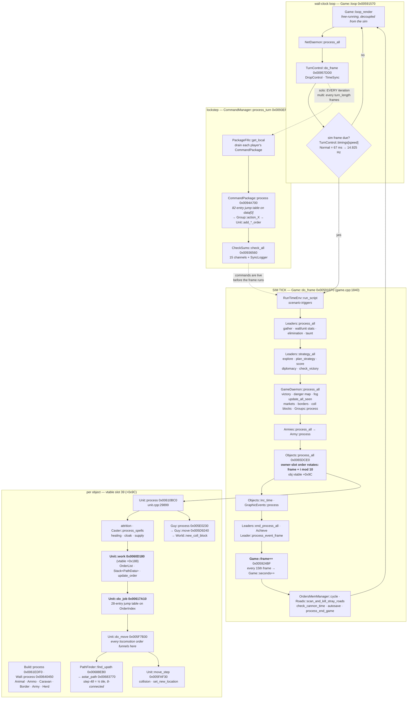

# The simulation architecture, from the shipped PDB

**What changed.** `ron-bin/sbl/rise.pdb` — 57 MB, GUID `{51D4F219-61C6-4F84-9D5B-C3361B0D291F}` age 1,
matching the CodeView record in `riseofnations.exe` — ships with the game. It is **not stripped**,
it carries **full DBI line information**, and that means every function in the retail binary comes
with the **original source filename and line number** it was compiled from. We are no longer
reading a stripped binary. We are reading Big Huge Games' source tree with the bodies replaced by
x86.

This document is the map Ember asked for: *a big sight onto the simulation architecture*. It
covers the recovered source tree, the main tick and its exact subsystem ordering, the real unit
pathfinder, the command/order path, and the simulation/presentation boundary. Where the PDB
contradicts something already written down in `docs/derivation/*.md`, it says so loudly in §8 —
those corrections are the most valuable part of the document.

Companion documents, produced by parallel lanes on the same PDB: `docs/derivation/pdb-types.md`
(class layouts, `sizeof`, field offsets from the TPI stream) and
`docs/tooling/ledger-reconciliation.md`. This one is the **control-flow and module** map; that one
is the **data** map. Read both.

---

## 0. Provenance and method

Everything below is `[measured]` on this Mac against `ron-bin/riseofnations.exe`
(sha256 `30478a44…625079`, PE32 i386, image base `0x00400000`) and `ron-bin/sbl/rise.pdb`, unless
explicitly marked `[reported]`.

The extractor is ~60 lines of Rust over the `pdb` crate (willglynn), walking every DBI module,
taking every `S_GPROC32`/`S_LPROC32`/`S_THUNK32`, converting the section offset to an RVA through
the address map, and pairing it with the **lowest-offset line record for that procedure** — which
is the line of its opening brace.

```
va  size  module(.obj)  srcfile  line  name
0068a030   128   …/game/PathFinder.obj   …/main/game/pathfinder.cpp   4143   PathFinder::PathFinder
```

**22,701 procedures** across **391 modules with debug info** (778 DBI modules total; the rest are
import libraries with no symbol stream). Cross-checked against `schema/rise-symbols.tsv`: the
procedure set covers **20,384 distinct `.text` VAs** and is a superset of the 17,942 `.text`
publics, missing only **30**. Coverage of authored code is effectively complete.

Three derived tools, all in the session scratchpad, all reproducible in a minute:

| tool | does |
|---|---|
| `funcs.tsv` | the table above |
| `byfile.py <path-fragment>` | every function in a source file **ordered by source line** — reconstructs the original file layout |
| `calls.py <va>` | disassembles a function and prints its **direct calls in address order**, each symbolised with `name [srcfile:line]` |
| `xref.py <va>` | reverse call graph over all 22,701 functions |
| `vtdump2.py <va> <n>` | dumps a vtable, symbolising each slot |

`calls.py` is the one that mattered. Reading a function's ordered call list, with every callee
named and located in a source file, is how the tick ordering in §3 was recovered — it took one
command.

**One caveat that will bite anyone using the symbol table naively.** MSVC identical-COMDAT-folding
merges every empty method body. `0x0041bff0` is a single `xor eax,eax; ret` shared by ~70 distinct
names (`UnitOrder::is_move`, `UnitOrder::get_move_order`, `Window::get_button`, …). A VA→name map
built from publics will hand you an arbitrary one of them. Always check the size: a 3-byte or
8-byte function is a folded stub, not the thing you were looking for.

---

## 1. The source tree

### 1.1 Roots

The build machine was `E:\agent\_work\2\s\main\` — an Azure DevOps agent workspace, consistent
with the 2024 MSVC-14 rebuild. Four first-party roots:

| root | functions | code bytes | what it is |
|---|---:|---:|---|
| `main/game/` | 12,425 | 5,207,950 | **Rise of Nations itself** — simulation, rules, UI, scenario, Conquer-the-World |
| `main/basic/` | 4,463 | 668,749 | BHG's foundation library — containers, `String`, `Random`, math, Steam/lobby glue |
| `main/bighuge/` | 1,774 | 320,412 | the BHG engine — window/event framework, buffers, image IO, animation manager, profiler |
| `main/pnglib/` `main/zlib/` | 195 | 85,765 | vendored third-party |

Plus MSVC CRT/STL headers (3,052 functions), `cpprestsdk`, the Steamworks SDK, `cellsdk`,
`cpclib`, `crossplaynetlib`.

**903 distinct first-party source files**, of which **606 under `game/`** (373 of them `.cpp`),
113 under `basic/`, 120 under `bighuge/`.

### 1.2 The naming convention is the architecture

Big Huge Games used a rigid three-way class split, and it is the single most useful structural
fact in the whole PDB:

| suffix | means | example |
|---|---|---|
| `XData` | **POD simulation state + pure queries.** No mutation, no rendering. | `UnitData::attack()`, `WorldData::is_seen()` |
| `X` | **simulation behaviour.** Mutates state, advances the tick. | `Unit::process()`, `Unit::fight()` |
| `XOut` | **presentation.** Draw, sort, HUD, options menus. | `UnitOut::draw()`, `ObjectsOut::sort_all()` |
| `XType` / `XTypeData` | **static rule data** loaded from `ron-data/*.xml` | `UnitType`, `BuildTypeData::calc_gather()` |

Within `main/game/`: 987 `*Data::` methods (314 KB), 460 `*Out::` methods (343 KB), 249 `*Type::`
methods (96 KB), 1,583 window/HUD/render methods (950 KB), and 7,656 plain-class methods (3.35 MB).

**The consequence for the port is sharp: the cut line is the class prefix, not the file.**
`unit.cpp` is 236 KB and contains both `Unit::fight` and 19 KB of `UnitOut::draw_underlays`. There
is no such thing as a "sim file"; there are sim *classes* interleaved with presentation classes in
the same translation unit. Any plan that says "port `unit.cpp`" is wrong by about 20%.

### 1.3 The top 40 source files

Function counts and total code bytes from the PDB; `max line` is the highest source line seen in
that file, a lower bound on its true length. Descriptions are from reading the function names in
each file, not from the filename.

| # | file | funcs | bytes | max line | what it is |
|---:|---|---:|---:|---:|---|
| 1 | `game/scriptfunctions.cpp` | 843 | 134,025 | 20,082 | `ScenarioFuncSet::*` — the ~800 trigger-script builtins the campaign/scenario system exposes. The scripted-AI and scenario action vocabulary. |
| 2 | `game/orders.h` | 685 | 33,217 | 2,566 | The **entire Order class hierarchy**, defined inline in the header. 60 `walk_data` methods, one per order type. This is the action space. |
| 3 | `basic/array.h` | 538 | 79,513 | 618 | `Array<T>` template instantiations. 17 distinct `walk_data`. |
| 4 | `basic/objectarray.h` | 431 | 72,807 | 535 | `ObjectArray<T>` — arrays of non-POD with ctor/dtor. |
| 5 | `basic/arraybase.h` | 366 | 53,640 | 324 | Array growth/copy primitives (`increase_size`). |
| 6 | `game/leaders.cpp` | 331 | 217,595 | 29,172 | **The player record.** Tech tree, upgrades, resource caps, market prices, diplomacy, and the entire production/strategy AI. Contains the largest function in the game. |
| 7 | `game/game.cpp` | 279 | 84,407 | 9,443 | The `Game` singleton: init/teardown, mode dispatch (`run_solo`/`run_scenario`/`run_editor`/`run_playback`), victory checks, and **`Game::do_frame` — the tick**. |
| 8 | `game/unit.cpp` | 273 | 236,417 | 29,899 | **The unit.** Stats, orders, movement, collision, combat, aircraft physics, the `think_*` unit AI, the `do_*` order executors, and `Unit::process`. |
| 9 | `bighuge/window.h` | 264 | 7,567 | 2,708 | 264 empty virtual `on_*` event stubs (all COMDAT-folded). |
| 10 | `basic/linklist.h` | 254 | 30,720 | 947 | `LinkList` / `PtrLinkList`. |
| 11 | `basic/basecolors.cpp` | 232 | 1,508 | 158 | 232 dynamic initializers for named `Color` globals. Nothing else. |
| 12 | `game/gameaccess.cpp` | 207 | 8,789 | 515 | **The global root set** — 200 dynamic-init/atexit pairs binding `GameAccess::*` references. See §2. |
| 13 | `basic/str.cpp` | 198 | 36,481 | 5,508 | `String` — including `String::fraction`, the rules.xml value tokenizer. |
| 14 | `game/graphicpieces.cpp` | 182 | 171,469 | 11,522 | Art binding: unit/building/ammo → mesh, particle, animation. Pure presentation, and one of the largest files. |
| 15 | `game/groups.cpp` | 153 | 107,049 | 12,529 | Formation and group state: `compute_form`, `update_positions`, `action_*` group commands. |
| 16 | `basic/recycler.h` | 153 | 20,882 | 110 | Free-list object pools. `Recycler<T>::temp_pool` statics. |
| 17 | `game/gamespy.cpp` | 150 | 46,846 | 7,945 | Matchmaking/lobby backend, now Steam-backed behind the GameSpy API shape. |
| 18 | `basic/namedarray.h` | 144 | 20,667 | 717 | Name-keyed arrays (rules lookup). |
| 19 | `basic/steam.h` | 140 | 8,856 | 496 | Steam lobby key/value plumbing. |
| 20 | `bighuge/window.cpp` | 135 | 33,754 | 4,430 | Window/z-order/focus/event framework. |
| 21 | `bighuge/profile.h` | 132 | 11,549 | 463 | The section profiler (`profile_init` statics). |
| 22 | `basic/simplearray.h` | 131 | 22,914 | 850 | POD arrays with `walk_data`. |
| 23 | `game/nuke.cpp` | 130 | 34,543 | 2,261 | Nuke **visual FX** — mushroom stalk, dust ring, scorch. `Nuke::do_damage` is the only sim function in it. |
| 24 | `basic/ptrarray.h` | 124 | 26,558 | 369 | `PtrArray<T>` — 11 `walk_data`, including `PtrArray<Guy>` (garrison contents). |
| 25 | `basic/stack.h` | 122 | 12,979 | 287 | `Stack<T>` — notably `Stack<PathData>`, the pathfinder's output buffer, which is checksummed. |
| 26 | `game/setupwin.cpp` | 122 | 112,152 | 10,334 | Pre-game lobby / slot / ranked UI. |
| 27 | `game/map.cpp` | 108 | 95,484 | 9,101 | **Map generation.** `MapWarringStates::make_continents`, `place_player_resource`, river lists, resource divvying. Per-map-style subclasses. |
| 28 | `game/world.cpp` | 102 | 33,994 | 4,367 | **The tile world.** Terrain/fog/territory queries and mutators, `compute_reg_territory`, `reveal_fog`, `analyze_map`. |
| 29 | `game/miscaccess.cpp` | 100 | 4,709 | 291 | The **presentation/session** root set — `MiscAccess::*`. See §2. |
| 30 | `game/conquestwin.cpp` | 98 | 66,455 | 6,532 | Conquer-the-World campaign map screen. |
| 31 | `game/commandpackage.cpp` | 97 | 38,796 | 2,793 | **The lockstep wire unit.** `CommandPackage::process` dispatches every command opcode. |
| 32 | `game/basicrendermethods.h` | 92 | 8,789 | 406 | Render method vtable boilerplate. |
| 33 | `game/terrainout2.cpp` | 89 | 62,438 | 10,943 | Water/coast/road mesh generation, crater deformation. Presentation. |
| 34 | `game/scenarioeditor.cpp` | 89 | 48,446 | 5,437 | The scenario editor. |
| 35 | `game/chataction.h` | 85 | 8,121 | 380 | Chat slash-command action classes. |
| 36 | `game/scenariodata.cpp` | 84 | 13,603 | 681 | Scenario state — objectives, reveal points, queued orders. Is a checksum channel. |
| 37 | `game/build.cpp` | 81 | 73,513 | 7,839 | **The building.** Production queue, gather points, garrison, plunder, `Build::process`. |
| 38 | `game/commandmanager.cpp` | 81 | 18,902 | 2,622 | **The command layer.** ~70 `issue_*` methods + `process_turn`. See §5. |
| 39 | `game/options.cpp` | 78 | 87,264 | 11,435 | Per-player gameplay options **and** the hotkey command dispatchers (`do_repair`, `do_halt`, `do_cycle_military`). Half sim, half UI. |
| 40 | `game/object.cpp` | 77 | 65,204 | 7,513 | **The combat core.** `ObjectData::get_damage`, `Object::do_damage`, `take_damage`, `find_nearby_target`, `do_launch`. |

Honourable mentions just outside the top 40, all sim-critical: `game/terrainout.cpp` (77, 81 KB,
presentation), `game/conquestleaders.cpp` (74), `game/borders.cpp` (73, presentation only),
`game/objects.cpp` (72, the object registry and spatial query layer), `game/buildtype.cpp` (71,
building rules), `game/worldmap.cpp` (71, minimap), `game/conquestgame.cpp` (69),
`game/checksums.cpp` (56, the desync channel list), `game/pathfinder.cpp` (47, 29 KB),
`game/terrain.cpp` (47), `game/roads.cpp` (41), `game/orders.cpp` (41),
`game/turncontrol.cpp` (33, the lockstep clock), `game/constants.cpp` (5 functions, 90 KB — see §8).

---

## 2. The global root set: `GameAccess` vs `MiscAccess`

`gameaccess.cpp` and `miscaccess.cpp` do nothing but define references to global singletons. The
two namespaces are the authors' own top-level partition of the program, and the PDB hands us the
whole list with names.

```
0x00C0617C  GameAccess::conquest_game : ConquestGame&
0x00C06180  GameAccess::turn_control  : TurnControl&
0x00C06184  GameAccess::game_random   : Random&        <-- see §8.1
0x00C06188  GameAccess::world         : World&
0x00C0618C  GameAccess::objects       : Objects&
0x00C06198  GameAccess::obj_base      : int*
0x00C0619C… GameAccess::{bonustypes,govtypes,itemtypes,spelltypes,goodtypes,techtypes} : PtrArray<*Type>&
0x00C061B4  GameAccess::leader_options
0x00C061B8  GameAccess::regions
0x00C061BC  GameAccess::game_daemon   : GameDaemon&
0x00C061C0  GameAccess::ai_speed      : int&
0x00C061C4  GameAccess::ai_off        : int&
0x00C061EC  GameAccess::game          : Game&
0x00C061F0  GameAccess::constants     : Constants&
0x00C061F4… GameAccess::{buildtypes,objecttypes,unittypes}
0x00AD0424… GameAccess::{achieve,searcher,graphic_events,mountains,units,hotkey_groups,groups,
             pathfinder,tribes,nuke_effect,farms,leaders,caravans,lands,oil_wells,supplies,docks,
             wonders,forts,herds,specials,heroes,goods,items,team_colors,forms,unbuilt_*,cities,
             collcheck,armies,setup} + 34 Categories (game rules/settings enumerations)
```

**102 `GameAccess::` members, 66 `GameAccessConst::` members** — the latter are `const` aliases of
the same objects. That immediately explains a standing observation:

> README-LLM: "**RULES**: `[0x00C061E4]` and `[0x00C061F0]` **alias the same object** (live-read)."

Correct, and now explained: `[0x00C061F0]` is `GameAccess::constants : Constants&` and
`[0x00C061E4]` is `GameAccessConst::constantsc : const Constants&`. Same object, two references,
one mutable and one not. The same pattern holds for `world`/`worldc`, `objects`/`objectsc`,
`pathfinder`/`pathfinderc`, and 60-odd more. This is not aliasing to be explained away; it is a
deliberate const-correctness facade.

`MiscAccess` (55 members) holds `camera`, `options`, `message_win`, `scene`, `console`,
`graphic_pieces`, `terrain`, `borders`, `roads`, `rivers`, `cliffs`, `mouseover`, `cursors`,
`worldmap`, `top_menu`, all the `iface_*` screens, **and also** `check_sums`, `command_manager`,
`netdaemon`, `drop_control`, `record_game`.

**So `MiscAccess` is not "presentation".** It is "everything that is not the simulation domain
model": rendering, UI, *and* the networking/lockstep session layer. `GameAccess ⊂ sim` holds;
`sim ⊆ GameAccess` does **not** — `roads` and `terrain` live in `MiscAccess` and both carry
sim-critical state. Use `GameAccess` as a strong positive signal, never as the boundary. The
boundary is §7.

---

## 3. The main simulation tick

### 3.1 The outer loop

```
Game::run              0x00584590  game.cpp:8404   (mode dispatch)
 └─ Game::run_solo     0x00587830  game.cpp:6916   / run_scenario / run_campaign / run_playback / …
     └─ Game::loop     0x00591570  game.cpp:2487   <-- the frame loop
```

`Game::loop`, in call order [measured]:

```
Window::is_visible / OptionsWin::exec           (pause menu)
GameLog::create_report
Game::get_render_mode  →  Game::loop_render     <-- RENDER, unconditional, every wall-clock frame
NetDaemon::process_all                          (drain the socket)
TurnControl::do_frame           0x00957DD0      <-- decides whether a SIM frame is due
    ├─ DropControl::process_time_outs
    ├─ TimeSync::update
    ├─ TurnControl::do_frame_solo   0x009556A0    (solo/playback)
    └─ TurnControl::do_frame_multi  0x00955440    (multiplayer)
  if it returns true:
Game::do_frame          0x00591EF0  game.cpp:1840  <-- THE SIM TICK
TurnControl::get_frame_timing
Game::loop_render                               (again, possibly several times)
```

Render is decoupled from simulation and runs free; simulation advances only when
`TurnControl::do_frame` says a frame is due. `Game::do_frame` has exactly **one caller**
(`Game::loop`), verified by a reverse call graph over the direct `call rel32` edges of all 22,701
PDB-known functions. That method sees direct calls only, so it was closed by scanning every dword of
`.rdata` and `.data` for the address: **`Game::do_frame` and `Objects::process_all` appear in no
data table at all** — no vtable, no function-pointer array — so there is no indirect route to them
either. (`Unit::process`, by contrast, appears in exactly three vtables, as expected.) [measured]

### 3.2 The clock — and the tick rate is not 15 Hz

`TurnControl::do_frame_solo` does, in order [measured from `re/decomp-all/009556a0.c`, structure
only]: a re-entrancy guard (it will raise "re-entrant do_frame_solo!" through `Error::report`), a
rolling frame-time average `avg ← (avg*9 − t₀ + now)/10`, then **`CommandManager::process_turn`**,
then optionally a script step, then `check_new_frame_solo` (or `check_new_frame_playback`), and if
a new frame is due it bumps the frame counter, issues a periodic camera command, refreshes the
period from a table, and returns 1.

That table is `TurnControl::timings`, `0x00AFC4A4`, and it is **five ints, milliseconds per sim
frame** [measured]:

| index | `rules.xml` `gamespeeds` category | ms/frame | Hz |
|---:|---|---:|---:|
| 0 | Very Slow | 200 | 5.000 |
| 1 | Slow | 125 | 8.000 |
| 2 | **Normal** | **67** | **14.925** |
| 3 | Fast | 50 | 20.000 |
| 4 | Hyper Fast | 1 | ~1000 (uncapped) |

The category names come from `ron-data/rules.xml` `<CATEGORIES id="gamespeeds">`, in this exact
order, so index 2 is Normal.

Separately, at the **end** of `Game::do_frame` [measured, `0x005924BF`–`0x005924E7`]:

```
005924bf  inc  dword [ebx+0x550]        ; Game::frame++            <-- the sim frame counter
005924cf  mov  eax, [ebx+0x550]
005924d5  mov  ecx, 15
005924db  idiv ecx
005924dd  test edx, edx
005924df  jne  ...
005924e1  inc  dword [ebx+0x560]        ; Game::seconds++          <-- 15 frames == 1 game second
005924e7  call TurnControl::check_cannon_time
```

**Both facts are real and they are not the same fact.** The *simulation* defines one second as
exactly 15 frames — that is what `rules.xml`'s header comment ("Times are specified in 'frames' or
fifteenths of seconds") means, and it is what every `"450 frames"` rule value is denominated in.
The *wall clock* pacing at Normal is 67 ms, i.e. 14.925 frames/s. A "30-second" gather rate of 450
frames therefore takes **30.15 s of real time**, not 30.00 s.

For a headless RL environment this is a non-issue: we step frames, and 15 frames = 1 sim second
exactly. It matters for exactly two things — comparing our clock against a real match's wall
clock, and replay timing. See §8.4.

### 3.3 `Game::do_frame` — the ordered subsystem update

This is the list the Rust scheduler has to reproduce. Recovered by disassembling
`Game::do_frame` (`0x00591EF0`, 1,879 bytes) and symbolising every direct call in address order
[measured]. Conditional calls are marked.

| # | call | VA | source | note |
|---:|---|---|---|---|
| 0 | `AutoSave::restore` | `0x005A20C0` | autosave.cpp:115 | only if `Game+0x821 & 0x20` |
| 1 | `GameLog::begin_frame` | `0x00932A70` | gamelog.cpp:333 | desync-log frame marker |
| — | *(frame-time bookkeeping: `timeGetTime`, 30-slot rolling window at `Game+0x8A8`)* | | | |
| 2 | `Random::get` | `0x00A39D70` | random.cpp:28 | **debug artificial-lag only**, gated on `Game+0x9E0 != 0`. **Not a sim draw.** See §8.5 |
| 3 | `CommandManager::issue_player_speed` | `0x00943100` | commandmanager.cpp:119 | every 8 frames, phase-offset per player |
| — | *(`GetKeyboardState` into `Game+0xAF0`, 64 dwords double-buffered)* | | | |
| 4 | `RunTimeEnv::run_script` ×2 | `0x0043D0E0` | runtimeenv.h:113 | scenario/trigger script step |
| 5 | `ConquestGame::place_reinforcements` | `0x00798880` | conquestgame.cpp:6202 | CTW only |
| 6 | `TutorialPromptWin::exec` | `0x007C2810` | tutorialpromptwin.cpp:14 | tutorial only |
| 7 | `SteamLeaderboards::UploadScore` | `0x00A36190` | steamleaderboards.cpp:129 | conditional |
| 8 | **`Leaders::process_all`** | `0x006ED2A0` | leaders.cpp:28778 | **per-player economy** |
| 9 | `NetDaemon::process_all` | `0x00951300` | netdaemon.cpp:34 | socket pump — **called 5× inside one tick** |
| 10 | *(diplomacy chat: `LeaderData::is_neutral/get_player/is_ally/is_enemy` → `Leader::set_diplo` → `Leader::chat_to_local`)* | | leaders.cpp | AI diplomacy messages |
| 11 | **`Leaders::strategy_all`** | `0x006ED430` | leaders.cpp:28747 | **per-player AI** |
| 12 | **`GameDaemon::process_all`** | `0x00732700` | gamedaemon.cpp:1403 | **world-level systems** |
| 13 | **`Armies::process_all`** | `0x006F3B00` | armies.cpp:695 | army aggregation |
| 14 | **`Objects::process_all`** | `0x0065DCE0` | objects.cpp:5287 | **every unit, building, wall, projectile** |
| 15 | `Objects::inc_time` | `0x0065DB70` | objects.cpp:5434 | animation/time advance for all objects |
| 16 | `GraphicEvents::process` | `0x008E50A0` | graphicevent.cpp:434 | FX event queue |
| 17 | `Leaders::end_process_all` | `0x006ED070` | leaders.cpp:28794 | post-pass; emits player feedback messages |
| 18 | `Achieve::capture_data` | `0x007AF980` | achieve.cpp:244 | achievements |
| 19 | `Leader::process_event_frame` | `0x006EC180` | leaders.cpp:28958 | loop over **8** leaders — `?leaders@@3VLeaders@@A` at `0x00E3A390`, stride `0x6EEC` = 28,396 B, ending at `0x00E71AF0` [measured] |
| 20 | **`Game::frame++`** | `0x005924BF` | | **the sim frame counter increments here** |
| 21 | `OrdersMemManager::cycle` | `0x00730E20` | ordmemmgr.cpp:43 | recycle freed order nodes |
| 22 | `Roads::scan_and_kill_stray_roads` | `0x008956A0` | roads.cpp:3647 | |
| 23 | *(`frame % 15 == 0` → `Game::seconds++`)* | `0x005924CF` | | |
| 24 | `TurnControl::check_cannon_time` | `0x009579E0` | turncontrol.cpp:116 | "cannon time" = the no-rush / countdown timer |
| 25 | `SaveGame::save_game` / `LoadGame::load_game` | `0x005A8220` / `0x005A72F0` | save.cpp:1081 / :1217 | autosave, conditional |
| 26 | `GameLog::end_frame` | `0x009329D0` | gamelog.cpp:354 | |
| 27 | `Game::process_end_game` | `0x00591CE0` | game.cpp:2182 | |
| 28 | `Scene::process_capture_sequence` | `0x008C13C0` | scene.cpp:137 | cinematic capture |

Second level, all `[measured]` by the same method:

**`Leaders::process_all`** → for each active player, in slot order:
`Leader::gather` (leaders.cpp:14645) → `Leader::calc_wall_stats` (:13858) → `Leader::calc_unit_stats`
(:13831) → `Leader::process_elimination` (:28526) → `Leader::process_taunt` (:28050).

**`Leaders::strategy_all`** → `Leader::check_explore` (:26413) → `Leader::plan_strategy` (:26880,
11 KB) → `Leader::compute_score` (:26828) → `Leader::diplomacy` (:23630, **20,348 bytes — the
largest function in the game**) → `Game::check_victory` (game.cpp:1561).

**`GameDaemon::process_all`** → `GameDaemon::process_victory` (:585) → `calc_danger` (:102) →
`update_all_seen` (:232, starts with `World::clear_seen`) → `calc_markets` (:420) →
`check_borders` (:476) → `process_coll_blocks` (:556) → `Groups::process` (groups.cpp:12529).

So **fog of war, danger maps, market prices, borders and collision blocks are all recomputed once
per tick, before units move**, and group/formation logic runs at the tail of the same pass.

**`Objects::process_all`** — the per-object dispatch, and it has a detail that matters enormously
for a deterministic reimplementation. Structure from `re/decomp-all/0065dce0.c` (hypothesis,
cross-checked against the disassembly):

```
for i in 0..10:
    s = (game.frame + i) % 10                      # <-- OWNER SLOT ORDER ROTATES EVERY FRAME
    for each object in slot[s] band 0:
        if active: object->vtable[0x9C]()          # ::process
        else:      object->cooldown--
for s in 0..10 (fixed order):
    for each object in slot[s] band 2000.., then band 3000..:
        if active: object->vtable[0x9C]()
if game.frame % 32 == 0:  spawn wildlife using GameAccess::game_random
if game.frame % 64 == 0:  Herd::process on one herd, round-robin
```

There are **ten owner slots** here (the game has 8 player leaders; the extra two are presumably
nature/unowned — not yet pinned). The first band iterates them in an order that **rotates by one
each frame**; the later bands do not. Reproduce that rotation exactly or your object update order —
and therefore your RNG consumption order — diverges within one tick.

Vtable slot `+0x9C` is confirmed [measured] against the `Unit` vtable at `0x00B417D0`:

```
slot 31 (+0x7C)  Unit::walk_data   0x0060CF40  unit.cpp:5167     <-- checksum/save
slot 39 (+0x9C)  Unit::process     0x00610BC0  unit.cpp:29899    <-- the per-object tick
slot 40 (+0xA0)  Unit::inc_time    0x00610B40  unit.cpp:12502
```

**`Unit::process`** (3,272 bytes, the last function in `unit.cpp`) calls, in order:
`LeaderData::get_general_upgrade` → `Unit::suffer_attrition` → `Caster::process_spells` →
tribe-bonus/prerequisite checks → `LeaderData::get_heal_level` → `UnitData::mana` →
`ObjectData::train_time` → `Objects::init_unit` (spawn) → `Unit::go_inside` →
`Unit::process_healing` (unit.cpp:29562) → `Unit::come_out` → `Unit::process_cloak` (:28935) →
`Unit::process_attrition` (:29185) → `Unit::process_supply` (:29845) → **`Guy::process`**
(guy.cpp:2540). `Guy::process` in turn calls **`Guy::move`** (guy.cpp:2309) — the movement
integrator — then `WorldData::get_tregion` and `World::new_coll_block`.

The `Guy` class is the physical-body layer under `Unit`: position, angle, bank, pitch, animation
state, collision block. `Unit` is the game-logic layer on top of it.

### 3.4 The tick, as a picture



---

## 4. Inside one object: the per-unit tick chain

`Unit::process` has **zero direct callers** — it is reached only through vtable slot 39. Inside it,
the order-execution step is another virtual, **slot 98 (`+0x188`)**, called at `0x00611814`
immediately before `Guy::process`. That slot is `Unit::work` [measured, `Unit` vtable
`0x00B417D0`].

```
Objects::process_all
 └─ obj->vt[+0x9C]  =  Unit::process        0x00610BC0  unit.cpp:29899
     ├─ suffer_attrition / Caster::process_spells / process_healing
     ├─ process_cloak / process_attrition / process_supply
     ├─ this->vt[+0x188] = Unit::work       0x0060D180  unit.cpp:28330   <-- ORDER EXECUTION
     │    ├─ UnitData::order_type / get_action
     │    ├─ LinkListBase<UnitOrder*, uchar, RecycledOrderNode>::{tail,prev,remove_current}
     │    ├─ Stack<PathData>::{push,pop}            <-- the unit's path buffer
     │    ├─ Unit::update_order / repath / check_target_path / kill_current_order
     │    └─ Unit::do_job                  0x00617A10  unit.cpp:28743   <-- ORDER-TYPE DISPATCH
     └─ Guy::process                       0x005E0230  guy.cpp:2540
          └─ Guy::move                     0x005D9240  guy.cpp:2309     <-- MOVEMENT INTEGRATOR
              → WorldData::get_tregion, World::new_coll_block
```

`Unit::do_job` is a **jump table at `0x00617B94`, 28 entries, indexed directly by `OrderIndex`**
[measured]:

| ord | executor | ord | executor |
|--:|---|--:|---|
| 0 `NONE` | virtual `[unit+0x184]` (`do_idle`) | 14 `CAST_SPELL` | `do_cast` `0x005EBFE0` |
| 1 `MOVE_TO` | **`Unit::do_move` `0x005F7B30`** :15757 | 15 `TRADE_ROUTE` | `do_trade` `0x005ED270` |
| 2 `ATTACK_TO` | `do_attack_to` `0x005F2320` | 16 `STRAFE` | `do_strafe` `0x005EAB00` |
| 3 `EXPLORE_TO` | `do_explore_to` `0x005F24A0` | 17 `AIR_PATROL` | `do_air_patrol` `0x005EA620` |
| **4 `FLEE_TO`** | **`do_move` — same arm as `MOVE_TO`** | 18 `CHANGE_FORM` | `do_form_change` `0x005E8670` |
| **5 `PATROL`** | **default arm — no-op** | 19 `GROUP_MOVE` | `do_group_move` `0x005E79A0` |
| 6 `BUILD_AT` | `do_build` `0x005EEBF0` | 20 `GROUP_ATTACK` | `do_group_attack` `0x005E75A0` |
| 7 `GATHER` | `do_gather` `0x005EF2A0` | 21 `GROUP_ATTACK_TO` | `do_group_attack_to` `0x005E74E0` |
| 8 `BOARD_SHIP` | `do_board` `0x005ED1F0` | **22 `GROUP_PATROL`** | **`Unit::do_patrol` `0x005F1910`** |
| 9 `AWAIT_BOARD` | `do_await_board` `0x005ED040` | 23 `ATTACK_GROUND` | `do_attack_ground` `0x005F1410` |
| 10 `ATTACK` | `do_attack` `0x005F1B80` :20156 | 24 `AIR_ATTACK_GROUND` | `do_air_attack_ground` `0x005EA420` |
| 11 `FOLLOW` | `do_follow` `0x005E65D0` | 25 `SPECIAL_ANIM` | `do_spec_anim` `0x005E5880` |
| 12 `GUARD` | `do_guard` `0x005E5C70` | 26 `GARRISON` | `do_garrison` `0x005E6B80` |
| 13 `REPAIR` | `do_repair` `0x005EE420` | 27 `THINK` | `do_think_order` `0x005E5BF0` |

Two surprises worth carrying into the port [measured]: **`FLEE_TO` and `MOVE_TO` share one
executor**, and **`OrderIndex::PATROL` (5) falls to the default arm and does nothing** — every live
patrol in the game is a `GROUP_PATROL` (22), which is what `Unit::do_patrol` actually serves.

`do_explore_to`, `do_flee_to`, `do_attack_to`, `do_guard`, `do_follow` and `do_group_move` all call
through to `do_move` [measured, reverse call graph]. So **`Unit::do_move` (unit.cpp:15757,
4,582 bytes) is the single funnel for all locomotion** and is the first function to port.
`Unit::do_job` has exactly two callers: `Unit::work` and `Animal::work` (`0x005D7330`,
animal.cpp:537).

Sibling `process` implementations reached through the same slot: `Build::process` (build.cpp:7217,
5,090 bytes — which itself calls `Wall::process`, `Object::do_launch`, `Build::do_attack`,
`Build::train`, `Build::find_gather_tiles`), `Wall::process`, `Animal::process`, `Ammo::process`,
`Caravan::process`, `Border::process`, `Army::process`, `Herd::process`.

---

## 5. The command and order path

There are **two distinct layers** here, and conflating them has already caused confusion in the
existing docs. They are:

| layer | unit | count | lives in | scope |
|---|---|---:|---|---|
| **Command** | `CommandPackage` | ~70 `issue_*` | `commandmanager.cpp` / `commandpackage.cpp` | *player intent*, network-serialised, lockstep-ordered |
| **Order** | `UnitOrder` subclass | 27 types | `orders.h` / `orders.cpp` / `unit.cpp` | *unit-level execution state*, per-unit linked list, checksummed |

A command like `issue_move_to` is issued once by a player, travels over the wire in a
`CommandPackage`, and on execution installs a `MoveOrder` on each selected unit's order list. The
order then lives for many frames, advanced by `Unit::work`/`do_job` every tick. `replay-stream.md`
is right that the command table is "materially richer than the 27-class `Order` hierarchy" — they
are different layers, not competing lists of the same thing.

### 5.1 The order type enum, exactly

`OrderNames` is a `String[]` at `0x00ECEBA0`, built by the dynamic initializer at `0x00405E50`
(orders.cpp:51). Reading the string literals it pushes gives the enum **in index order**
[measured]:

| # | name | # | name | # | name | # | name |
|--:|---|--:|---|--:|---|--:|---|
| 0 | `NONE` | 7 | `GATHER` | 14 | `CAST_SPELL` | 21 | `GROUP_ATTACK_TO` |
| 1 | `MOVE_TO` | 8 | `BOARD_SHIP` | 15 | `TRADE_ROUTE` | 22 | `GROUP_PATROL` |
| 2 | `ATTACK_TO` | 9 | `AWAIT_BOARD` | 16 | `STRAFE` | 23 | `ATTACK_GROUND` |
| 3 | `EXPLORE_TO` | 10 | `ATTACK` | 17 | `AIR_PATROL` | 24 | `AIR_ATTACK_GROUND` |
| 4 | `FLEE_TO` | 11 | `FOLLOW` | 18 | `CHANGE_FORM` | 25 | `SPECIAL_ANIM` |
| 5 | `PATROL` | 12 | `GUARD` | 19 | `GROUP_MOVE` | 26 | `GARRISON` |
| 6 | `BUILD_AT` | 13 | `REPAIR` | 20 | `GROUP_ATTACK` | 27 | `THINK` |

**27 order types plus `NONE`** — which confirms `docs/CHARTER.md`'s "27-class Order hierarchy",
now with the actual names and indices. The C++ side has **31 `*Order` classes**: the 27 concrete
ones plus the abstract bases `UnitOrder`, `TargetOrder`, `AirOrder`, `GroupOrder` [measured, class
prefixes in `funcs.tsv`].

The same enum is in the PDB as `OrderIndex`, with `NUM_UNIT_ORDERS = 28`, alongside the order flag
bits `ORDER_PATHED 1 · ORDER_FLEEING 2 · ORDER_GROUP 4 · ORDER_DEFENSIVE 8 · ORDER_MORE_WORK 16 ·
ORDER_DISEMBARK 32 · ORDER_PUSHED 64 · ORDER_FACING_TARGET 128` — the bits of `UnitOrder::flags`
(`char @ +4`) [measured].

**Storage.** The order list is a `LinkListBase<UnitOrder*, unsigned char, RecycledOrderNode>` at
`UnitData +0x00CC` (the `OrderList` wrapper starts at `+0x00C8`), 24 bytes:
`current_data@0, current_metric@4, current_node@8, length@12, head_node@16, ordered@20`.
`UnitData::get_order` (`0x0060B030`), `UnitData::order_type` (`0x00616E80`) and
`Unit::update_order` (`0x006179D0`) all perform the *same* refresh, then `order_type` **tail-calls
the virtual `get_type()`** — so the authoritative order type is the virtual, not the cached metric
byte [measured].

**Allocation.** `OrdersMemManager` (ordmemmgr.cpp) is 28 `SafeRecycler<UnitOrder>` pools, one per
`OrderIndex`, each a pair of `Stack<UnitOrder*>` (clean/dirty). `cycle` (`0x00730E20`) runs once
per sim frame from `Game::do_frame` at `0x005924C5` and flips the pools — **freed orders stay
readable until the next frame boundary**. Factory `get_new_order` (`0x00730550`, orders.cpp:489);
cloner `copy_order` (`0x0072F900`). `orders.cpp` is only 41 functions, almost all `operator=` and
`print_details`; the *behaviour* lives in `unit.cpp`. There is **no `ordmgr.cpp`** in this build.

`UnitOrder`'s vtable is a **double-dispatch table**: slots 0–56 are lifecycle/query
(`~UnitOrder`, `clear`, `walk_data`, `log_data`, `get_type`, `is_move`, `is_attack`,
`is_move_attack`, `is_targeted`, `is_pathed`, `is_fleeing`, `is_group`, `is_air`, `is_patrol`,
`print_details`), slots 60–176 are 30 `update_<X>_order` methods, slots 180–292 are the
`get_<X>_order` down-casts. The base implementations are all the same 3-byte COMDAT stub at
`0x0041BFF0` [measured].

### 5.2 The command layer

`CommandManager` (`commandmanager.cpp`, 81 functions) exposes **67 `issue_*` methods**. Each one
gates on `check_accept_issue`, then writes a packed byte record. Opcode and record length below were
extracted from the machine code of each function — the `u8` written at offset 0 and the length
pushed to `add_command` [measured]. `grp` marks the ones that emit a `COMMAND_GROUP` prefix naming
the selection. **This table is the top-level RL action space, with its wire encoding.**

| VA | :line | op | name | bytes | grp |
|---|--:|--:|---|--:|:-:|
| `00941530` | 407 | 2 | `issue_stance` | 5 | Y |
| `00941580` | 427 | 3 | `issue_form` | 13 | Y |
| `009415E0` | 449 | 4 | `issue_attack` | 17 | Y |
| `00941650` | 477 | 5 | `issue_siege_attack` | 13 | Y |
| `009416B0` | 504 | 6 | `issue_swarm_around` | 17 | Y |
| `00941720` | 532 | 7 | `issue_move_to` | 22 | Y |
| `009417A0` | 589 | 9 | `issue_attack_ground` | 10 | Y |
| `00941800` | 611 | 10 | `issue_patrol` | 10 | Y |
| `00941860` | 633 | 11 | `issue_launch_patrol` | 25 | Y |
| `009418D0` | 659 | 12 | `issue_halt` | 1 | Y |
| `00941910` | 693 | 14 | `issue_set_transport` | 5 | Y |
| `00941960` | 767 | 17 | `issue_trade` | 21 | Y |
| `009419D0` | 799 | 18 | `issue_city_gather` | 9 | Y |
| `00941A20` | 820 | 19 | `issue_gather` | 9 | Y |
| `00941A70` | 841 | 20 | `issue_garrison` | 13 | Y |
| `00941AD0` | 865 | 21 | `issue_disband` | 5 | Y |
| `00941B20` | 885 | 22 | `issue_gather_point` | 17 | Y |
| `00941B80` | 908 | 23 | `issue_spell` | 21 | Y |
| `00941BE0` | 932 | 24 | `issue_queue_up` | 9 | Y |
| `00941C30` | 954 | 25 | `issue_build` | 25 | Y |
| `00941CA0` | 980 | 26 | `issue_eject_all` | 17 | Y |
| `00941D00` | 1003 | 27 | `issue_alarm` | 1 | Y |
| `00941D40` | 1022 | 28 | `issue_flight` | 25 | Y |
| `00941E30` | 1047 | 29 | `issue_stop_spell` | 1 | Y |
| `00941E70` | 1102 | 30 | `issue_follow` | 13 | Y |
| `00941ED0` | 1124 | 31 | `issue_guard` | 13 | Y |
| `00941F30` | 1146 | 32 | `issue_unitmask` | 9 | Y |
| `00941F80` | 1167 | 33 | `issue_buildmask` | 9 | Y |
| `00941FD0` | 1188 | 34 | `issue_hotkey` | 25 | Y |
| `00941DB0` | 1065 | 35 | `issue_recall` | 1 | Y |
| `00941DF0` | 1083 | 36 | `issue_scramble` | 1 | Y |
| `00942100` | 1228 | 37 | `issue_treaty` | 13 | · |
| `00942200` | 1253 | 38 | `issue_declare` | 13 | · |
| `00942300` | 1278 | 39 | `issue_clear_tributes` | 9 | · |
| `00942400` | 1302 | 40 | `issue_clear_all` | 9 | · |
| `00942500` | 1326 | 41 | `issue_accept` | 9 | · |
| `00942600` | 1350 | 42 | `issue_reject` | 9 | · |
| `00942700` | 1374 | 43 | `issue_tribute` | 17 | · |
| `00942810` | 1400 | 44 | `issue_demand_tribute` | 17 | · |
| `00942920` | 1426 | 45 | `issue_propose_attack` | 17 | · |
| `00942A30` | 1452 | 46 | `issue_buy` | 13 | · |
| `00942A80` | 1468 | 47 | `issue_sell` | 13 | · |
| `00942C40`/`00942CE0` | 1484/1501 | 48 | `issue_unqueue` ×2 | 15 | · |
| `00942C90` | 1518 | 49 | `issue_come_out` | 11 | · |
| `00942AD0` | 1817 | 50 | `issue_ping` | 9 | · |
| `00940F70` | 1832 | 51 | `issue_spline` | var | · |
| `00940B60` | 198 | 52 | `issue_speed_set` | 5 | · |
| `00940B30` | 212 | 53 | `issue_speed_up` | 1 | · |
| `00940B00` | 225 | 54 | `issue_speed_down` | 1 | · |
| `00941070` | 1534 | 55 | `issue_mp_log` | 1 | · |
| `00940770` | 1591 | 57 | `issue_check_sums` | 65 | · |
| `009410B0` | 1691 | 59 | `issue_cheat_view_all` | 5 | · |
| `00940FA0` | 1759 | 64 | `issue_cheat_ai_toggle` | 1 | · |
| `00941130` | 1772 | 65 | `issue_cheat_increase_buckets` | 5 | · |
| `009410F0` | 1786 | 66 | `issue_cheat_zero_buckets` | 5 | · |
| `00942B10` | 1867 | 68 | `issue_chat` | var | · |
| `00941490` | 1844 | 69 | `issue_chat_set` | 9 | · |
| `00941170` | 337 | 70 | `issue_resign` | 5 | · |
| `00941360` | 296 | 71 | `issue_quit` | 7 | · |
| `00940A20` | 280 | 72 | `issue_camera` | 10 | · |
| `00942080` | 1930 | 73 | `issue_leader_option` | 33 | · |
| `00940390` | 1955 | 74 | `issue_turn_data` | 11 | · |
| `009411D0` | 148 | 75 | `issue_rename_city` | 53 | · |
| `00940BA0` | 187 | 76 | `issue_pause` | 2 | · |
| `00941260` | 164 | 77 | `issue_cannon_time` | 2 | · |
| `00940FD0` | 1939 | 78 | `issue_console_cmd` | 521 | · |
| `00943100` | 119 | 79 | `issue_player_speed` | 9 | · |

The full `CommandTypes` enum in the PDB has **82 entries**. Fifteen have no `CommandManager::issue_*`
and are produced elsewhere or engine-internally: `0 GROUP`, `1 BEGIN`, `8 MOVE_NEAR`, `13 TRANSPORT`,
`15 BOARD_SHIP`, `16 REPAIR`, `56 CHECK_RANDOM`, `58 NEXT_CHECK_SUM`, `60`/`61 CHEAT_*_TECHS`,
`62`/`63 CHEAT_AI_SPEED_*`, `67 CHEAT_INIT_UNIT`, `80 UNGRACEFUL_PLAYER_DROP`, `81 MARWAN`.

### 5.3 The full lifecycle, step by step

[measured throughout, by disassembly of each stage]

1. **Selection layer.** `Group` is the current selection. `GroupOut::issue_*` (groups.cpp:2029–3378,
   48 methods) validates against it and calls down — e.g. `GroupOut::issue_move_to` `0x0070AF40` →
   `CommandManager::issue_move_to` `0x00941720`.
2. **`CommandManager::issue_*`.** Gates on `check_accept_issue` (`0x00940A70`, :238), then builds a
   **flat, unaligned, packed byte record on the stack** — `u8 opcode` at +0, fields at fixed byte
   offsets — and calls `CommandPackage::add_group` then `CommandPackage::add_command`.
3. **`CommandPackage::add_group`** (`0x0094BB60`, :427) emits a `COMMAND_GROUP` (opcode 0) record
   naming the selection: `u8 op; u8 num; u8 who; i16 ids[num]` = `3 + 2*num` bytes — **or**, if the
   selection is byte-identical to the previous one, a 3-byte record with `num == 0` meaning *"same
   selection as last time"*.
4. **`CommandPackage::add_command`** (`0x0094BAE0`, :537) `memcpy`s into `local_package.data[size]`.
5. **`CommandManager::send_local_package`** (`0x00940120`, :2043) appends `issue_turn_data` and
   `issue_camera`, bumps the stamp, sends, resets `size = 0`, and stores `Game::random` into
   `local_package.padding`.
6. **`CommandPackage::send`** (`0x0094C1E0`, :2793) builds the wire packet in
   `CommandPackage::send_buffer` (`0x00CC00C0`) and hands it to `netsys` (`0x00E335C8`).
7. **Arrival** → `CommandManager::process_command_package_data` (`0x0093FCD0`, :2106) →
   `PackageFifo::add` (`0x00952880`) — a **20-slot ring per player**.
8. **`CommandManager::process_turn`** (`0x0093EF10`, :2293) dequeues via `PackageFifo::get_local`,
   runs `CheckSums::check_all`, and calls `CommandPackage::process_all` (`0x0094C500`).
9. **`CommandPackage::process_all`** de-XORs the payload, then loops
   `CommandPackage::process(cursor)`, advancing the cursor **by the byte count each handler
   returns**, until `size` is consumed.
10. **`CommandPackage::process`** (`0x0094A700`, commandpackage.cpp:676) is an **82-entry jump table
    at `0x0094B5F4`** on `data[0]`. `process_group` rebuilds the target `Group`; the following
    `process_X` calls **`Group::action_X`** (groups.cpp).
11. **`Group::action_X`** → `Unit::add_*_order` (unit.cpp:26117–27200) → a `UnitOrder*` is pushed
    onto that unit's `OrderList`.
12. **Per sim frame** the order is advanced by `Unit::work` → `Unit::do_job` → `Unit::do_<order>`
    (§4).

Three details in that chain are load-bearing and were not previously recorded anywhere:

- **The package has a hard 512-byte cap and silently drops overflow.** `add_command` is
  `if (size + len > 0x200) return 0;` — no retry, no error. Commands issued past the cap in one
  turn are lost.
- **Under `game[0x820] & 4` (networked/recording), `add_command` and `add_group` insert 0–2 random
  skip bytes between records**, drawn from the same `Random` the simulation uses. The reader draws
  the same values to skip them. Command serialisation is therefore an RNG consumer.
- **`CommandPackage::send` XORs the payload with `(u16)(Game::random_state >> 8)`** and prefixes an
  8-byte header: `u8 0x07; u32 stamp; u8 play; u16 size`. `padding` at `+0x214` is not inert — it
  carries an RNG-state fingerprint.

**The action-legality gate**, `CommandManager::check_accept_issue` (`0x00940A70`, :238) — this is
the predicate an RL environment has to satisfy before an action is even representable [measured]:

```
if (cmdmgr.use_mp_playback)                       reject
if (game[0x820] & 0x10)                           reject      // replay playback
if (!(game[0x820] & 4))                           ACCEPT      // not networked / not recording
if (game[0x821] & 8)                              ACCEPT      // immediate-execute mode
if (console && console->x28 && vcall[+0x10])      reject
if (!Player::is_active_connection(game.player[console.play]))  reject
if ((*(u8*)([0xC06180]+0x10) & 1) && !(game[0x20] & 0x40))     ACCEPT else reject
```

In a headless single-player environment the third line short-circuits to ACCEPT, so no command is
ever refused at this layer — all real masking has to come from the per-command validity checks in
`GroupOut::issue_*` and `Group::action_*`.

`CommandPackage` layout, from the PDB type stream: `stamp@0, play@4, valid@8, group@12, size@16,
data[512]@18, padding@532`, `sizeof = 536`. `group` is a parse cursor and is **not sent**.
`PackageFifo` is `front@0, front_local@4, length@8, length_local@12, packages[20]@16`, and
`get_local` deliberately **retains the last three packages** for `PackageFifo::resend`.

### 5.4 Frames, turns, and the single-player/multiplayer asymmetry

A **turn** is `TurnControl::turn_length` frames. `CommandManager::process_turn` is the point where
commands are applied, and `CheckSums::check_all` runs inside it — so the ordering is
**apply commands → checksum → simulate**. A reimplementation that applies actions *after* stepping
diverges on frame 1.

But the two code paths differ in a way that matters enormously to an RL environment [measured]:

```
TurnControl::do_frame_multi  0x00955440  (turncontrol.cpp:891)
    if (check_new_frame_multi()) {
        if (++turn_counter == turn_length) {       // <-- a TURN is turn_length FRAMES
            SyncLogger::newTurn(...);
            CommandManager::process_turn();        // <-- commands applied here only
            TurnControl::compute_next_turn_multi();// <-- turn_length RE-DERIVED from latency
            turn_counter = 0;
        }
        return !(semaphore & 1);
    }

TurnControl::do_frame_solo   0x009556A0  (turncontrol.cpp:842)
    frame_average = (frame_average*9 - frame_timing_clock + timeGetTime()) / 10;
    CommandManager::process_turn();                // <-- UNCONDITIONAL, EVERY loop iteration,
                                                   //     BEFORE the frame gate
    if (check_new_frame_solo()) { ... return 1; }
    return 0;
```

**In single-player, commands take effect with zero turn latency. In multiplayer they wait
`turn_length` frames, and `turn_length` is adaptive** — `compute_next_turn_multi` (`0x00955880`,
1,882 bytes) is its sole writer and recomputes it from measured wait/lag/ping. That is a *code-path*
difference, not a tuning constant: our environment should model the solo path (zero latency) and
treat MP latency as a separately configurable delay.

`CommandManager::process_turn` reaches `CommandPackage::process_all` from **three** branches —
replay playback, replay recording, and live MP — and calls `Game::loop_render` in the middle of
itself, which is the "waiting for players" spin. Its skeleton also includes `DropControl`
(`process_time_outs` / `process_drops` / `process_need_syncs` / `check_for_drop`),
`CommandManager::issue_check_sums`, `send_local_package`, and `recover_from_oos` (`0x0093E9E0`).

`TurnControl` itself is 376 bytes and is checksummed (`TurnControl::walk_data` `0x00956C50`), with
`speed@0x30`, `playback_speed@0x34`, `target_frame_time@0x38`, `turn_length@0x3C`,
`turn_counter@0x40`, and seven parallel per-player `u32[8]` telemetry arrays at `+0x54..+0x133`.
`CommandManager::issue_turn_data` (opcode 74, 11 bytes) ships ping/frame-average/wait/lag/forced-loads
each turn, and `TurnControl::process_turn_data` (`0x00956A60`) files them into those arrays.

---

## 6. The pathfinder

### 6.1 There are three A\* engines and five domains, not one pathfinder

`game/pathfinder.cpp` is ~3,938 lines and 47 functions. The class triple is
`PathFinder` / `PathFinderData` / `PathFinderOut`, with a single global
`pathfinder : PathFinder` at `0x00E85E40` and the reference `GameAccess::pathfinder` at
`0x00AD0484`. Recovered layout, by source line [measured]:

| line | VA | size | function | domain |
|---:|---|---:|---|---|
| 1398 | `0x00685990` | 2,411 | `PathFinder::astar_caravan_road` | **roads/caravans** |
| 1888 | `0x00684E50` | 2,732 | `PathFinder::calc_cost` | **units/water/tiles** |
| 2329 | `0x00683770` | **5,845** | **`PathFinder::astar_path`** | **units/water/tiles — the real one** |
| — | `0x00686300` | 912 | `PathFinder::calc_road_cost` | roads |
| — | `0x00686690` | — | `PathFinder::astar_river` | rivers |
| — | `0x00687930` | — | `PathFinder::calc_river_cost` | rivers |
| 3684 | `0x00682F30` | 2,033 | `PathFinder::find_upath(Stack<PathData>*, Coord, Coord, int,int,int)` | unit path, full form |
| 3922 | `0x00688EB0` | 130 | `PathFinder::find_upath(Stack<PathData>*, int,int,int)` | unit path, id form |
| 3938 | `0x00688F40` | 121 | `PathFinder::find_upath_restore` | unit path, resume |
| — | `0x00688E10` / `0x00688FC0` | | `PathFinder::find_wpath` ×2 | **water** path |
| — | `0x00688E60` / `0x006897D0` | | `PathFinder::find_tpath` ×2 | **tile** path |
| — | `0x00683730` | | `PathFinder::find_wpath_army` | water, army-sized |
| — | `0x00688A40` | | `PathFinder::find_road` | road |
| — | `0x00685950` | | `PathFinder::find_road_restore` | road, resume |
| — | `0x00687970` / `0x00687AA0` | | `first_open_node` / `add_to_openlist` | open list |
| — | `0x00688270` / `0x006882B0` / `0x00688310` | | `PathFinderData::find_node_closed` / `find_node_open` / `get_estimate` | closed/open lookup, **the heuristic** |
| — | `0x00687C80` / `0x00687D60` / `0x00687DA0` | | `valid_ucoord` / `valid_tcoord` / `valid_wcoord` | per-domain validity |
| — | `0x00688740` | | `PathFinderData::valid_roadcoord` | road validity |
| — | `0x00689CB0` | | `PathFinder::walk_data` | **it is checksummed** |

Three coordinate spaces appear in the signatures — `Coord` (unit-space, `UCoord`), `TCoord` (tile),
`WCoord` (world/water cell). Each is a **4-byte struct wrapping a single `int`**: they are *scalar*
coordinate types with cross-conversion operators, not points, which is why every signature carries
them in pairs [measured, PDB type stream].

**There are three separate A\* implementations**, not one parameterised engine [measured]:

| engine | VA | serves | cost fn | validity fn | budget / resume |
|---|---|---|---|---|---|
| **A** `PathFinder::astar_path` | `0x00683770` | **units, water, tiles** | `calc_cost` `0x00684E50` | `valid_ucoord`/`valid_tcoord`/`valid_wcoord` | none |
| **B** `PathFinder::astar_caravan_road` | `0x00685990` | roads / caravans | `calc_road_cost` `0x00686300` | `valid_roadcoord` `0x00688740` | 3,200 nodes; parks state in the global `Caravans` array |
| **C** `PathFinder::astar_river` | `0x00686690` | **map generation only** | `calc_river_cost` `0x00687930` | — | — |

Engine A is domain-polymorphic, and **the selector is its second argument: the grid step in world
units** [measured, `push` sites at the three call points]:

| domain | entry | step | grid |
|---|---|---:|---|
| unit (`upath`) | `find_upath` `0x00682F30` → `0x00683359` | **`0x30` = 48** | **¼ tile (`UCoord`)** |
| tile (`tpath`) | `find_tpath` `0x006897D0` → `0x00689BEB` | `0xC0` = 192 | 1 tile (`TCoord`) |
| water (`wpath`) | `find_wpath` `0x00688FC0` → `0x0068974A` | `0x300` = 768 | 4 tiles (`WCoord`) |

Inside `astar_path` the step is both the neighbour stride
(`child = parent + move_x[dir]*step`, with `move_x` at `0x00ADCAF0` = `{0,-1,0,1,1,1,0,-1,-1}` and
`move_y` at `0x00ADC400` = `{0,-1,-1,-1,0,1,1,1,0}` — 8-connected plus a null entry) and the
validity-function selector (`cmp ecx,0x300` → `valid_wcoord`; `cmp ecx,0xC0` → an inlined
`UnitData::invalid_loc`; otherwise `valid_ucoord`).

> **The unit pathfinder is `PathFinder::astar_path` @ `0x00683770`, driven through the public
> `PathFinder::find_upath` @ `0x00688EB0` → inner `find_upath` @ `0x00682F30`, with cost
> `PathFinder::calc_cost` @ `0x00684E50` and validity `PathFinder::valid_ucoord` @ `0x00687C80`,
> on a 48-world-unit (¼-tile) 8-connected grid.**

The prior lane's derivation targeted engine B. See §8.3.

`PathFinderData` (136 bytes, at `0x00E85E80` — `pathfinder` `0x00E85E40` + `0x40`) has **five**
containers, not three: `openlist` (`Tree<PathNode*,int>*`), `openlistrefs`, `closedlist`
(`BRTree<PathNode*,ulong>*`), **`blocklist`** (`Tree<CollBlock*,int>*`) and **`validlist`**
(`BRTree<int,ulong>*` — the memo `valid_ucoord` writes into). `PathNode` is 36 bytes:
`x, y, length` (g), `estimate` (h), `value` (f, the tree key), `timeout`, `metric` (the BRTree key),
`z_val`, `transport`, `building`, `parent`. `PathData` — the output waypoint record — is
`{ Coord to_x; Coord to_y; int tolerance; int flags; }`, which **confirms and promotes**
`pathfinding.md`'s `[inference]` that the third field is an arrival tolerance: it is literally named
`tolerance`.

### 6.2 How a move order reaches it

Every runtime unit path in the game funnels through exactly **two** functions [measured, exhaustive
direct-call scan of `.text`]:

```
CommandPackage::process_move_near / ScenarioFuncSet::unit_*_order      (network, UI, script)
        └─> Group::action_move_near  0x00704990  groups.cpp:6645   (23 call sites)
              └─> Unit::add_*_order → OrderList
                    └─> Unit::do_job → do_move / do_group_move / do_guard / do_follow /
                                       do_attack_to / do_flee_to / do_explore_to
                          └─> Unit::do_move  0x005F7B30  unit.cpp:15757
                                ├─ PathFinder::find_upath_restore  @0x005F7E24
                                ├─ PathFinder::find_wpath (inner)  @0x005F8410   ┐ coarse
                                ├─ PathFinder::find_tpath (inner)  @0x005F8484   ┘ long-range legs
                                ├─ Unit::find_path      0x005FB910  unit.cpp:13276
                                ├─ Random::get(...)                @0x005F89AF   <-- in the CALLER
                                ├─ PathFinder::find_upath (thin)   @0x005F8AA0   <-- THE PATHFINDER
                                └─ Unit::move_step      0x005FAF30  unit.cpp:13628
                                     ├─ Unit::detect_unit_collision   0x00617060 unit.cpp:14024
                                     ├─ Unit::resolve_unit_collision  0x005F9D30 unit.cpp:14765
                                     │     └─> find_upath (local detour)
                                     └─ Unit::set_new_location        0x005F8D20 unit.cpp:15429
```

`Unit::do_move` and `Unit::resolve_unit_collision` are the **only two callers of `find_upath`** in
the whole binary. `PathFinder::find_wpath_army` (`0x00683730`) has **zero callers** — dead in this
build; do not implement it.

This closes what `pathfinding.md` §8.1 called "the biggest gap in the lane": **the per-frame
movement integrator is `Unit::move_step` (`0x005FAF30`, unit.cpp:13628, 2,513 bytes)**, writing
through `Unit::set_new_location` (`0x005F8D20`, unit.cpp:15429, 42 call sites). The function that
doc called `Object::setPosition` (`0x00662680`) is `SubObject::set_new_location`
(subobject.cpp:253) — the low-level store one level below.

⚠ **`Unit::move_step` and `Unit::find_path` contain floating point** — `sin_table` (`0x00A46A00`,
trig.cpp:30), `cosx` (`0x0092D0C0`), `find_angle` (`0x0092D130`, gamemath.cpp:36). The "no float
anywhere in the movement cone" conclusion does not survive into the integrator, only into the
search.

### 6.3 The RNG question, settled — and not the way anyone expected

`[0x00C06184]` is `GameAccess::game_random : Random&`, holding `0x00E37A8C`, the file-scope
`?game_random@@3VRandom@@A` [measured, PDB symbol table + file bytes `8c 7a e3 00` + a type-3 base
relocation at that address]. There is no separate pathfinder generator, and every RNG draw anywhere
in `pathfinder.cpp` is on that one stream.

An exhaustive `E8`-scan of `.text` for calls to the four `Random` entry points finds **538 sites
image-wide**, of which **`pathfinder.cpp` contains exactly five** [measured]:

| VA | in | shape | when |
|---|---|---|---|
| `0x006848C4` | `astar_path` | `get(0,0xFFFF) % 3 + 6` | **once, on search FAILURE, unit domain only** |
| `0x00684E02` | `astar_path` | `get(0,0xFFFF) % 3 + 6` | **once, on search FAILURE** |
| `0x00686341` | `calc_road_cost` | `get(0,0xFFFF) % 20` | **per edge relaxation — ROADS** |
| `0x0068794E` | `calc_river_cost` | `(get(0,0xFFFF) % 20) + 10` | **per edge relaxation — RIVERS** |
| `0x006870B3` | `astar_river` | — | map generation |

**`PathFinder::calc_cost` — the unit/water/tile cost function — contains none.** Neither do any of
its ten direct callees (`WorldData::is_blocked_at` ×19, `was_really_seen`, `is_ocean`,
`LeaderData::is_enemy`/`is_ally`/`is_peace`/`get_target`, `Game::current_age`,
`UnitData::is_fleeing`/`needs_transport`).

And the two `astar_path` draws are **not costs**. Verbatim [measured, `0x006848B0`–`0x006848E1`]:

```asm
006848b0  call 0x6179d0            ; Unit::update_order  — on the BLOCKING unit
006848b5  mov  ecx, [0xc06184]     ; game_random
006848bd  push 0xffff / push 0
006848c4  call 0xa39d70            ; Random::get(0, 0xFFFF)
006848c9  cdq / mov ecx,3 / idiv ecx
006848d5  lea  esi, [edx + 6]      ; 6..8
006848db  mov  [eax + 0x1c], esi   ; blocking unit's order field := 6..8   <-- a RETRY DELAY
006848e1  add  byte [unit + 0xb2], 0x1e
```

Both sites sit in the **failure epilogue**, guarded by `param_2 == 0x30` — the unit domain only.
The draw perturbs a *third-party* unit's retry timer; it does not enter the path cost.

**So the corrected determinism statement is:**

- Unit pathfinding draws from the main simulation stream — so a divergence there *does* propagate.
- But it draws **at most once per failed search**, not once per edge. The claim that "the RNG
  serialises the inner loop of the most expensive subsystem" is **false for units**; it is true only
  for road/caravan and river routing.
- Reproducing unit search edge-for-edge is still mandatory, because a differing *number of failed
  searches* shifts the shared stream position for everything downstream.
- The much bigger RNG consumer on the movement path is the **caller**: `unit.cpp` has 35 RNG sites,
  one of them inside `Unit::do_move` itself at `0x005F89AF`.

The five `Random` objects in the entire image [measured, exhaustive symbol grep]:

| symbol | VA | role |
|---|---|---|
| `game_random` | `0x00E37A8C` | **the simulation stream** — reached as `GameAccess::game_random`, `[0x00C06184]` |
| `internal_random` | `0x00EB697C` | the non-sim stream — what the free function `random()` uses |
| `SoundGlobal::random` | `0x00E85F0C` | audio variation |
| `SoundType::random` | `0x00E87D3C` | audio variation |
| *(`GameAccess::game_random` is a reference, not a sixth object)* | `0x00C06184` | |

And the discriminator you can apply mechanically to any call site:

```
00A39D40  random()          : push ecx; push edx; push ecx; mov ecx, 0xEB697C; call Random::get
                              ^^^ hard-codes internal_random — NOT the sim stream
<sim code>                  : mov ecx, [0xC06184]; ... ; call 0x00A39D70
                              ^^^ GameAccess::game_random — IS the sim stream
```

The generator itself, confirmed at the instruction level [measured, `0x00A39CF0`]:

```
imul eax, [ecx], 0x19660D      ; 1664525
add  eax, 0x3C6EF35F           ; 1013904223
mov  [ecx], eax                ; state <- state*a + c
and  eax, 0x7FFFFF
or   eax, 0x3F800000           ; assemble a float in [1.0, 2.0)
movss/cvtps2pd/subsd/cvtpd2ps  ; subtract 1.0 — in DOUBLE, then round back to f32
```

The PDB names both `0x00A39CF0` and `0x00A39D70` **`Random::get`** — they are overloads
(`float get()` at random.cpp:58, `int get(int,int)` at random.cpp:28), not `next_float`/`in_range`.
`Random::reseed` (`0x00A39D30`) is an XOR-swap idiom whose net effect is `state = argument`.

---

## 7. Simulation versus presentation

### 7.1 The class-suffix signal

As established in §1.2, the split is *within* files, by class prefix. Aggregating over all
22,701 procedures with an explicit classifier (infra = `basic/` + `bighuge/`; then verified
presentation/network/editor file lists; then any file containing a `walk_data` → sim):

| class | functions | % | bytes | % |
|---|---:|---:|---:|---:|
| **simulation** (incl. rules) | 6,140 | 32.9 | 2,468,970 | 39.9 |
| **presentation** | 3,369 | 18.1 | 1,774,805 | 28.6 |
| shared infrastructure | 5,844 | 31.3 | 931,214 | 15.0 |
| platform / network | 1,168 | 6.3 | 395,347 | 6.4 |
| editor / tooling | 354 | 1.9 | 186,782 | 3.0 |
| residue (overwhelmingly presentation) | 1,787 | 9.6 | 439,993 | 7.1 |

**The reimplementable simulation surface is roughly 2.5 MB of x86 across ~6,100 functions.** Eight
files — `unit.cpp`, `leaders.cpp`, `object.cpp`, `objects.cpp`, `groups.cpp`, `build.cpp`,
`world.cpp`, `map.cpp` — are **832 KB / 1,197 functions**, one third of it.

But the suffix signal is a heuristic, and the `Unit` vtable proves it: slots 21–28 are
`UnitOut::make_options` / `draw` / `draw_overlays` / `draw_underlays` / `draw_shadows` /
`draw_health_bar` ×2, sitting directly between `UnitData::is_seen` (slot 18) and
`Unit::must_walk` (slot 30). One object, one vtable, both worlds. The real boundary is the next
section.

### 7.2 The engine's own answer: `walk_data`

`CheckSum`, `SaveGame` and `LoadGame` are three implementations of one `DataWalk` interface, so a
class's `walk_data` method *is* its declaration of sim-critical state. The PDB gives **266
`::walk_data` methods at 251 distinct VAs across 106 source files** [measured].

The heaviest contributors: `game/orders.h` 60 (one per order type), `basic/objectarray.h` 17,
`basic/array.h` 17, `basic/ptrarray.h` 11, `basic/linklist.h` 9, `basic/simplearray.h` 8,
`game/leaders.cpp` 7, `game/script/scripttype.cpp` 6, `game/scenariodata.cpp` 6,
`game/options.cpp` 4.

Anchors worth having by hand: `Unit::walk_data` `0x0060CF40` (unit.cpp:5167) ·
`Object::walk_data` `0x00647830` (object.cpp:2684) · `BuildData::walk_data` `0x0062F270` ·
`WallData::walk_data` `0x00642510` · `LeaderData::walk_data` `0x006D6750` (leaders.cpp:2701) ·
`World::walk_data` `0x006B5CF0` (world.cpp:1265) · `Objects::walk_data` `0x006541E0` ·
`PathFinder::walk_data` `0x00689CB0` · `TurnControl::walk_data` `0x00956C50` ·
`WalkDataGame::walk_data` `0x005A2360` (save.cpp:150) — the save root.

`checksum.md` §5 recorded three anonymous sub-walkers invoked from `Unit::walk_data` on
`this+0xB8`, `this+0xC8`, `this+0xE4` behind mask bits 2/4/8. They are now named [measured]:
`Stack<PathData>::walk_data`, **`OrderList::walk_data`**, `PtrArray<Guy>::walk_data`. A unit's
three optional sim sections are therefore **its path stack, its order list, and its garrison
contents** — a clean confirmation of the mask semantics and a very direct statement of what a
unit *is*, for our purposes.

### 7.3 The checksum channel list, and the four channels that are switched off

`CheckSums::check_all` (`0x00936560`, checksums.cpp:16, 1,614 bytes) is the sync checksum. Its
ordered channel list, with `SyncLogger::logToMemory` between each [measured, direct calls in
address order]:

1. `check_units` (checksums.cpp:502) · 2. `check_builds` (646) · 3. `check_walls` (715) ·
4. `check_ammo` (784) · 5. `check_deaths` (824) · 6. `check_groups` (863) · 7. `check_guys` (574) ·
8. `LeaderData::walk_data` **inline** · 9. `check_cities` (925) · 10. `check_items` (407) ·
11. `check_goods` (449) · 12. `World::walk_data` · 13. `Game::walk_rules_data` (game.cpp:6587) ·
14. `ScenarioData::walk_data` (scenariodata.cpp:515) · 15. `RunTimeEnv::walk_data`
(script/runtimeenv.cpp:474).

`checksums.cpp` declares **54** `CheckSums::check_*` methods in total — only 15 are wired into
`check_all`. Of the rest, `check_wdata` and `check_seen` run only from the save/load verifiers, and
**four are empty function bodies** [measured, disassembled]:

```
CheckSums::check_scene        0x00936EC0   ret 8
CheckSums::check_message_win  0x00936ED0   ret 8
CheckSums::check_searcher     0x00936EB0   ret 8
CheckSums::check_storm        0x00936EE0   ret 8
```

That is the engine telling us, in its own code, exactly which four subsystems it has decided are
*not* sim-critical: the render scene graph, the on-screen message ticker, the spatial search
helper, and weather. Nothing else is stated this plainly anywhere in the binary.

`CheckSums::check_pathfinder` (`0x00936E30`, 25 bytes) is **not** empty: it tail-jumps to the
walker with `begin = 0x00E85E98`, `end = 0x00E85F04` — a flat 108-byte window at
`pathfinder + 0x58`. The pathfinder's search state is lockstep-critical.

---

## 8. Corrections — loud

Each item is a claim currently written somewhere in the repo that this analysis contradicts or
materially sharpens. All corrections `[measured]`.

### 8.1 The sim tick is 67 ms at Normal speed, not 15 Hz — and `0x005924CF` is not the tick rate

> `docs/provenance-ledger.md`:229 — "**15 fps is confirmed in the binary** `[measured]`:
> `0x005924CF` divides the frame counter at …"
> `docs/derivation/sim-economy.md`:185–187 — "**The 15 fps is now [measured] in the binary**, not
> just asserted by the `rules.xml` header"
> `docs/prior-art-survey.md`:99 — "engine time unit is the **frame = 1/15 s at normal speed**"

**Two different quantities have been merged into one claim.**

`0x005924CF` is the *frames-to-seconds* conversion at the end of `Game::do_frame`: `Game::frame++`
at `0x005924BF`, then `if (frame % 15 == 0) Game::seconds++` at `0x005924E1`. That is genuinely
`[measured]` and it means the **simulation** defines one second as exactly 15 frames — which is
what every `"N frames"` rule value in `rules.xml` is denominated in. Keep it.

The **wall-clock tick period** is a different thing entirely, and it lives in
`TurnControl::timings` at `0x00AFC4A4` — `{200, 125, 67, 50, 1}` ms, indexed by the `gamespeeds`
category. **Normal is 67 ms = 14.925 Hz, not 15 Hz.** A 450-frame gather rate is 30.00 *game*
seconds and **30.15 real seconds**.

Consequences: `replay-stream.md`'s "10,500 frames ÷ 15 fps = 700.000 s = 11:40" is a game-clock
computation, not a wall-clock one — the real elapsed time was ~703.5 s. `AUDIT-replay.md` §F7 was
right to flag that equation as one equation in two unknowns; the tick period is now measured
independently, and it is 67 ms. `docs/tooling/ledger-reconciliation.md`:166, which resolved this to
`[measured]` on the strength of `0x005924CF`, should be revised: the *frame accounting* is
measured, the *tick period* is now separately measured, and they differ by 0.5%.

For a headless RL environment none of this matters — we step frames. It matters for wall-clock
comparison, replay playback timing, and anything in `docs/tracks/web-frontend.md` that budgets
against "the engine's real 15 Hz tick rate" (:250, :318, :356): the real figure is 14.925 Hz.

### 8.2 `Objects::process_all` rotates the player iteration order every frame

Not previously recorded anywhere. `Objects::process_all` iterates the first object band as
`s = (Game::frame + i) % 10` over ten owner slots, and the later bands in fixed order [measured].
Any scheduler that iterates owners in fixed order every tick will consume the shared RNG in a
different sequence and diverge. This is precisely the class of detail that a `[reported]`
architecture would never surface, and it is now the single most load-bearing ordering fact we hold.

Related and also unrecorded: `Leader::process_event_frame` (step 19) iterates **exactly 8** leaders
— `?leaders@@3VLeaders@@A` at `0x00E3A390`, stride `0x6EEC` = 28,396 bytes, terminating at
`0x00E71AF0` [measured]. Eight is the player count; the ten object-owner slots are a different
axis.

### 8.3 The prior "pathfinder" derivation is the caravan-road router

> `README-LLM.md` — "**Pathfinding**: pure-integer 8-connected grid A\*, draws RNG once per edge
> relaxation."
> `docs/derivation/pathfinding.md`:537 — the RNG-draw derivation, which is on `calc_road_cost`.

The functions that derivation examined are `PathFinder::astar_caravan_road` (`0x00685990`),
`PathFinder::calc_road_cost` (`0x00686300`), `PathFinderData::valid_roadcoord` (`0x00688740`) and
`PathFinder::find_road` (`0x00688A40`) — the **trade-road / caravan router**. Its only callers are
`BuildType::place_roads` and `Caravan::build_road`. **No unit ever calls it.** The unit pathfinder
is `PathFinder::astar_path` (`0x00683770`, pathfinder.cpp:2329, 5,845 bytes) — see §6.

The specific claims that do not survive:

| `pathfinding.md` says | correction [measured] |
|---|---|
| headline: "8-connected grid A\* **over the tile grid**, calls the RNG **once per edge relaxation**" | Two engines. The *unit* engine steps **48 world units = ¼ tile**, not 192. It calls the RNG **never** per edge — see §6.3. The headline describes road routing. |
| "§3 Cost of one step — `FUN_00686300` … `cost = Random::range(0,0xFFFF) % 20; cost += PF_BASE …`" | Entirely the **road** cost. `calc_cost` (`0x00684E50`, 2,732 bytes) shares none of it — different immediates, no RNG, no use of the nine road parameters — and it branches on the step argument to serve three domains. **`calc_cost` is still unread and must be derived from scratch.** |
| "§3 the eight cost constants — `PF_BASE`, `PF_WATER_TRANSPORT`, `PF_WATER_ENTRY`, `PF_FOREIGN_TERR`, `PF_NO_REGION`, `PF_TERRAIN`, `PF_ROUGH`, `PF_MAX_SLOPE`" | **All eight invented names are wrong, and there are nine.** The PDB names them `road_base_val`(55), `road_avoid_sea`(100), `road_cross_coast`(100), `road_enemy`(540), `road_noone`(240), `road_bad_path`(200), `road_river`(60), `road_z_max`(600), `road_diag_penalty`(8), at `PathFinderData +0x60..+0x80`. The *values* were right; every semantic label was wrong; **and the `road_` prefix proves they never touch unit movement.** |
| "§8.2 name → offset mapping for the cost constants — **could not establish**" | **Closed.** `PathFinderOut::registration` (`0x00687E40`, pathfinder.cpp:514) registers exactly those nine slots at `PathFinder +0xA0..+0xC0`, in declaration order. |
| "§3 candidate parameter names `value`, `estimate`, `transport`, `building`, `z_val`, `length`, `metric`, `timeout`" | **Refuted.** Those are `PathNode`'s **field** names, emitted by `PathNode::walk_data`/`log_data`, not registered parameters. |
| "§3 containers — `PathFinderData`'s first three members" | There are **five**; `blocklist` and `validlist` were missed entirely, and `validlist` is the memo `valid_ucoord` writes into. |
| "§3 time-slicing, budget `0xC80` = 3200, parks itself in `[0x00E3A2A0 + …]`" | **Road-only.** `astar_path` has no budget and no resume. And `0x00E3A2A0` is not a search-slot table — it is `?caravans@@3VCaravans@@A + 0x10`, the global `Caravans` array; each caravan parks its own road search. |
| "§3 the mode-A `-goalY` heuristic bug" | Real, but it is in `astar_caravan_road`. It has **no bearing on unit movement**; `astar_path`'s heuristics are `(60·d)/step` and `10·d`, neither of which negates. |
| "§3 `FUN_00685990` is `__stdcall` with 7 arguments" / "`FUN_00686300` `__stdcall`, 5 args" | Both are **`__thiscall`**. Any oracle harness calling them `__stdcall` reads garbage. |
| "§7 `0x00688A40` — path-request entry (unit/player)" | `PathFinder::find_road`. No unit calls it. |
| "§7 `0x00688FC0` / `0x006897D0` — likely path smoothing / local avoidance. **Unread.**" | `find_wpath` (water) and `find_tpath` (tile). Not smoothing — two of the four domains. |
| "§7 `0x006B53F0` — 2×2-tile grid query, cost doubles if 0" | `WorldData::was_seen` (world.cpp:585) — **fog of war**. Unexplored terrain costs 2× in *road* routing. |
| "§7 `0x006EDB50` — territory passability" | `LeaderData::is_ally` (leaders.cpp:4390). |
| "§7 `0x00687E40` — `PathFinder` reset (vtable slot 2)" | `PathFinderOut::registration` — the parameter-registration hook, not a reset. |
| "§6 six pathfinder entry points … `0x0068BC90`" | `Map::make` (map.cpp:7780). Not a pathfinder entry. |
| "§8.1 the per-frame movement integrator — **the biggest gap in the lane**" | **Closed** — `Unit::move_step` `0x005FAF30` → `Unit::set_new_location` `0x005F8D20`. And it uses `sin_table`/`cosx`/`find_angle`, so the no-float result does not extend to it. |
| "§3 output records `{x, y, 0x60, 0}`, `0x60` plausibly an arrival tolerance **[inference]**" | **Confirmed, promote to [measured]** — the field is named `tolerance` in `PathData`. |

What survives unchanged: the search is integer-only, 8-connected, and draws from the main sim
stream.

### 8.4 `[0x00C06184]` — corroborated

`docs/tooling/ledger-reconciliation.md` §1.1 and `docs/provenance-ledger.md` §4.1 already refuted
the "separate pathfinder `Random`" claim. This lane confirms it a third way, from the PDB symbol
table rather than from a pointer read: `?game_random@GameAccess@@2AAVRandom@@A` at `0x00C06184` is
a `Random&`; `?game_random@@3VRandom@@A` at `0x00E37A8C` is the object; `?internal_random@@3VRandom@@A`
at `0x00EB697C` is a *different* generator, and it is the one the free function `random()`
(`0x00A39D40`) hard-codes. `README-LLM.md`'s "script/sim uses fixed object `0x00EB697C`" is
backwards on both halves and should be deleted, not amended.

### 8.5 The `Random::get` call in `Game::do_frame` is a debug lag injector

`Game::do_frame` contains a `Random::get` at `0x0059202D`. It is inside
`if (Game+0x9E0 != 0) { n = Random::get(Game+0x9DC, Game+0x9E0); busy-wait n ms via Sleep(0); }`
— an artificial-latency debug feature, gated off in normal play [measured]. **It is not a per-frame
simulation draw.** Anyone transcribing the tick from the call list would otherwise replicate a
phantom RNG consumption on every frame and desync immediately.

### 8.6 `checksum.md`: sim-critical state is a strict *subset* of save state

> `docs/derivation/checksum.md` §3 — "**Consequence: sim-critical state ≡ save-game state.**
> Anything the engine bothers to save is checksummed by the identical traversal."

False. `WalkDataGame::walk_data` (`0x005A2360`, save.cpp:150) reaches 47 distinct `walk_data`s plus
~50 indirect dispatches. At least nine have **no `check_all` channel at all** — `Scene`,
`MessageWin`, `Doober`, `GraphicEvents`, `TileSet`, `Terrain`, `CliffsData`, `Mountains`,
`PtrArray<River>` — plus `Types`, `GameInfo`, `Achieve`, `CommandManager`, `LeaderOptions`,
`Array<Option>`, `Array<HotKeyGroup>`, `Array<SelectGroup>`. And four checkers are literally empty
(§7.3). The correct statement is **sim-critical ⊂ save-game**, and the *checksum* traversal is the
definition, not the save traversal. §7 item 2 of that doc ("recovering one recovers both") is
half-true: recovering the save gets you a superset that includes the camera, the scene graph, the
message ticker and tilesets.

The 15-channel `check_all` list in `checksum.md` §4 is **confirmed exactly**, channel for channel,
including `LeaderData::walk_data` inline at channel 8. Its open question "how often does
`check_all` run" is now answered: **only from `CommandManager::process_turn`**, twice, and from
nowhere else in the binary.

Three smaller corrections in the same document:
- `0x009370F0` is `CheckSums::check_seen` — the per-player fog-of-war *seen* planes, not an
  anonymous byte plane. Its siblings are `check_wdata` (`0x00937040`) and `check_tdata`
  (`0x009370A0`).
- The `DataWalk` slots are `walk_function` (slot 0) and `walk_test` (slot 1), not `walk`/`walk_tag`.
  `CheckSum::walk_test` at `0x0041BFE0` is COMDAT-folded with ≥40 unrelated empty methods, so a
  name-table lookup on that address returns garbage. Also note `CheckSum` (singular, the `DataWalk`
  subclass) is a different class from `CheckSums` (plural, the driver holding the 54 `check_*`).
- `0x00A46830` is `adler32` at **`main/basic/misc.cpp:464`** — BHG's own copy, not zlib's. `zlib` is
  a separate compilation root in this image (60 functions) and does not contain it. The algorithm
  identification and the Tier-B result stand; the provenance sentence does not.

### 8.7 The balance table base address is wrong

> `README-LLM.md` — "**Balance table**: base `0x00C06AFC`, 493×493 int16. ⚠ The captured window has
> unexplained negatives."

`0x00C06AFC` is not a symbol boundary — it falls in unnamed data between
`IncrementalLoad::read_increment` (`0x00C068B4`) and `printfOutputType` (`0x00C08070`) [measured].
The combat balance data lives in the global **`combat_table : Balance` at `0x00C12BF0`**
(`?combat_table@@3VBalance@@A`), built by `Balance::fill_tables(XMLElement)`
(`0x005823F0`, balance.cpp:226) from `ron-data/balance.xml`, and read through
**`Balance::type_damage(TypeIndex, TypeIndex)`** (`0x0057FB50`, balance.cpp:598, **8,524 bytes**),
`Balance::compute_modifier` (`0x00581CC0`, :494) and `Balance::return_pack` (`0x005821C0`, :444).
The "unexplained negatives" are the expected consequence of reading a window that is not the table.
Re-derive from `combat_table` and `Balance::type_damage`.

### 8.8 `replay-io.md` has three wrong command opcode names

The opcode table in `docs/derivation/replay-io.md` §5 was reconstructed from log-format string
literals. The PDB carries the real `CommandTypes` enum (82 entries, `NUM_COMMANDTYPES = 82`) and the
real handler names, and three rows are wrong [measured]:

| row | doc says | truth |
|---|---|---|
| `0x0F` (15) | `set_transport_o` | **`COMMAND_BOARD_SHIP`**, `CommandPackage::process_board_ship` `0x00948E00` (commandpackage.cpp:1376). Size 9 is right. |
| `0x2D` (45) | `demand_tribute_onoff` | **`COMMAND_PROPOSE_ATTACK`**, `process_propose_attack` `0x00946B30` (:1845), issued by `CommandManager::issue_propose_attack` `0x00942920`. This is a diplomacy *"attack player X with me"* proposal, **not a tribute toggle** — a real semantic error for anyone modelling diplomacy. |
| `0x44` / `0x45` | `chat_set` / `chat_stats` | **Swapped and both misnamed.** `0x44` (68) is `COMMAND_CHAT` → `process_chat` `0x009454F0` (:2064), variable length `19 + 2*len`. `0x45` (69) is `COMMAND_CHAT_SET` → `process_chat_set` `0x009458E0` (:2046), fixed 9 bytes. The handler addresses in that table are right; the names attached to them are not. |

Two cosmetic ones in the same table: `0x19` is labelled `queue_up_build` where the enum says
`COMMAND_BUILD` (`process_build` `0x00948110`), and `0x33` is labelled `ping_line` where the enum
says `COMMAND_SPLINE`. The enum names should win — they are what the source called them.

### 8.9 `schema/command-wire.json` is confirmed, with one caveat about variable-length records

All 82 entries of the `CommandPackage::process` jump table at `0x0094B5F4` were decoded from the
retail bytes and diffed against the file's `method` field: **zero mismatches**. Independently, each
record's byte length was extracted from the *writer* side (the `push <imm>` feeding `add_command`
inside each `issue_*`) and agrees with the file's `size` for every opcode resolvable that way.
Two independent extraction paths, one answer. **This artifact is trustworthy** [measured].

The caveat is not a contradiction but must be recorded: `size` there is the C++ `sizeof(struct)`,
and **three opcodes are variable-length on the wire**, so `size` is wrong as a parse increment for
them:

- **op 0 `GroupCommand`** (`size` 5) → real wire length `3 + 2*num`, where `num = data[1]`, and
  `num == 0` is the legal *"reuse the previous selection"* form.
- **op 68 `ChatCommand`** (`size` 19) → `19 + 2*len`, `len = i32 @ +13`, UTF-16 tail.
- **op 51 `SplineCommand`** (`size` 14) → `6 + 8*n`, `n = u16 @ +4`.

The authoritative parse increment is always the **return value of the `process_X` handler**, which
is what `process_all` uses.

### 8.10 `rng.md`: the four `Random` entry points are misnamed

Cosmetic but worth fixing before the names propagate into `crates/don-sim` [measured, PDB]:

| `rng.md` name | real name |
|---|---|
| `Random::next_float()` `0x00A39CF0` | **`Random::get()`** returning `float` (random.cpp:58) |
| `Random::in_range(lo,hi)` `0x00A39D70` | **`Random::get(int,int)`** (random.cpp:28) — an overload of the same name |
| `Random::exchange_seed(s)` `0x00A39D30`, "has no callers" | **`Random::reseed(unsigned long)`** (random.cpp:20) |
| "`in_range` on global A, `0x00A39D40` `__fastcall` wrapper" | free function **`random(int,int)`** (random.cpp:79) over `internal_random` |

Also: `rng.md` §6.2's open item "who calls `Map` vtable slot 25 (`0x0068BC90`)" resolves — that
address is **`Map::make`** (map.cpp:7780), a named method, not a vtable slot; nothing calls it
virtually. And there is now direct evidence that **the RNG state is inside the lockstep protocol**:
`?random_seeds@CommandPackage@@2PAKA` at `0x00CC02C8`, `CommandPackage::process_check_random`
`0x00946020` (commandpackage.cpp:1964), and `RecordGame::{read,write}_random_game_info`
(`0x009533E0` / `0x009534E0`). It is sync-checked **via `CommandPackage`, not via `checksums.cpp`**
— which is why looking for it in the `check_all` channel list came up empty.

### 8.11 Already corrected elsewhere — recorded here for coherence

These were fixed by parallel lanes on the same PDB while this document was being written; they are
listed so this map does not silently repeat the old versions. See
`docs/provenance-ledger.md` §4.9 and `docs/derivation/pdb-types.md` §5.

| old claim | truth |
|---|---|
| `FUN_00570170` is "the rules.xml constant loader" | `Constants::log_data(Log*)`, constants.cpp:47, 63,382 bytes. The **loader** is `Constants::init`, `0x00569A90`, constants.cpp:911. Same for `FUN_0061C490` = `UnitType::log_data` and `FUN_0065FC00` = `ObjectType::log_data`. The 112 "loaders" behind `schema/bindings.json` are the **debug dump** methods. The bindings themselves survive (`log_data` walks the same fields in the same order); the *tokenizer semantics* do not live there. |
| `RString::AsScaled` @ `0x00A1D110` | `String::fraction(int) const`, str.cpp:2569, returns `int` |
| `FUN_00644130` is "the damage computation" | correct, and it is `ObjectData::get_damage`, **object.cpp:614** |
| `0x00846450` is "dead code, not the RNG" | `Doober::get_num(TCoord, TCoord, int, int)`, doober.cpp:826 |
| `FUN_009459D0` is `process_check_sums` | correct: `CommandPackage::process_check_sums`, commandpackage.cpp:2020 |
| `FUN_00936560` is `check_all` | correct: `CheckSums::check_all`, checksums.cpp:16 |
| "27-class Order hierarchy" (`docs/CHARTER.md`:93) | **confirmed** — 27 order type codes plus `NONE`; 31 C++ classes because four are abstract bases. Names and indices in §5.1. |

---

## 9. What this changes for the port

1. **The scheduler now has a specification, not an inference.** §3.3 is the ordered subsystem list
   and §3.4 the diagram. Reproduce it in that order, including the five `NetDaemon::process_all`
   pumps (which are no-ops for us) as ordering landmarks, and including the frame-counter increment
   at step 20 — several later steps read `Game::frame` *after* it has been bumped.

2. **Command application precedes simulation, with zero latency in single-player.**
   `CommandManager::process_turn` runs inside `TurnControl::do_frame`, before `Game::do_frame`, and
   the checksum is taken between them: `apply(actions); checksum(); tick()`. In solo it runs on
   *every* loop iteration, so an action issued at step *N* is live in frame *N*. Model that; treat
   multiplayer's adaptive `turn_length` delay as a separate, optional wrapper.

3. **Object iteration order rotates.** `(frame + i) % 10` for the first band. This is not
   cosmetic; it determines RNG consumption order.

4. **`Unit::do_move` is the first function to port.** Every locomotion order funnels through it,
   and it is the gateway to `PathFinder::find_upath` → `astar_path`. Right behind it,
   `Unit::move_step` — the per-frame integrator, and the first place float enters the movement path.

5. **The RL action space has two levels** (§5): 67 `CommandManager::issue_*` at the player layer,
   28 `OrderIndex` values at the unit layer. Parameter-level masking has to be built against the
   command layer; order state is what the environment observes. Note that `PATROL` (5) is a dead
   enum value and `FLEE_TO` shares an executor with `MOVE_TO` — the *effective* order space is 26.

6. **Sim-critical state is the `walk_data` closure, not the save.** 251 walkers, 106 files. For
   determinism work, `check_all`'s 15 channels are the ground truth, four subsystems are explicitly
   excluded by empty checker bodies, and the **RNG state is sync-checked separately**, through
   `CommandPackage::process_check_random`, not through `checksums.cpp`.

7. **Batching boundaries fall out of §3.3.** `GameDaemon::process_all` recomputes fog, danger,
   markets, borders and collision blocks as five whole-world passes *before* any unit moves —
   these are naturally data-parallel. `Objects::process_all` is the serial-order-sensitive part.

8. **The unit pathfinder grid is ¼ tile (48 world units), not the tile grid.** Anything in
   `don-sim` that assumes tile-granularity unit A\* is wrong by 4× on each axis.

9. **Command serialisation is an RNG consumer.** Under networked/recording mode, `add_command` and
   `add_group` insert 0–2 random skip bytes per record from the sim stream. A headless environment
   that never serialises will *not* consume those draws — which is correct for our purposes, but it
   means our stream position cannot be compared against a recorded multiplayer game's.

---

## 10. Open questions

- **`PathFinder::calc_cost` (`0x00684E50`, 2,732 bytes, pathfinder.cpp:1888) is completely unread.**
  It is the real unit movement cost function, `__thiscall(Coord,Coord,Coord,Coord,int,int,int,uchar*)`.
  Its immediates are captured (`0x100, 0x124, 0x200, 0x2480, 0x400, 0xC8, 0xFA, 0x1F4, 0x384,
  0x3E8, 0x7D0, 0x1388`, masks `0x2000/0x300/0xFA0/0xFF`) but none of their meanings are derived.
  **This is the single highest-value remaining pathfinding task**, and it must not be filled in from
  the road-cost derivation.
- **`astar_path`'s heuristic selector.** It picks between `(60·d)/step` and `10·d` on a branch at
  `0x00683D72`/`0x00683EE3`; the predicate is read but not settled. Do not guess it.
- **The float/transcendental cone must be re-run from `0x00683770`**, not `0x00685990`, and must
  include `Unit::move_step`, which does use `sin_table`/`cosx`/`find_angle`.
- **`TurnControl::compute_next_turn_multi` (`0x00955880`)** is the sole writer of `turn_length` and
  therefore sets multiplayer command latency. The comparison has the shape
  `measured < turn_length * X >> 1`; the exact adaptation formula is not derived.
- **The four `Game` flag bits that gate the whole command path** — `game[0x820] & 0x04`
  (networked/recording), `& 0x10` (playback), `game[0x821] & 0x08` (immediate execute), `& 0x20`
  (abort parse) — are used at every gate in §5 but have no recovered field names.
- **Only the `move_to` leg** of `Group::action_X → Unit::add_*_order` has been traced end to end.
  The other ~44 `Group::action_*` (groups.cpp:2029–12221) are enumerated but not individually
  followed.
- **Whether the second and third object bands** (index ≥ 2000 and ≥ 3000) correspond to buildings
  and walls, or to some other partition. The band boundaries are hard-coded constants in
  `Objects::process_all`; the meaning is inferred, not measured.
- **`Game::do_frame` conditional edges.** The ordered list in §3.3 is the static call order; several
  entries are guarded by flag bits at `Game+0x821`/`+0x822` whose meanings are not yet named. The
  PDB's TPI stream has the `Game` class layout — `docs/derivation/pdb-types.md` is the place to
  resolve them.
- **`TurnControl::timings` index selection.** `get_frame_timing` picks between two speed indices
  (`TurnControl+0x30` and `+0x34`) depending on `Game+0x820 & 0x10` and a global at `0x00EA51C4` —
  presumably playback/fast-forward. Not yet pinned.
- **Whether `Leaders::process_all` iterates players in slot order or a rotated order.** The
  `Objects` rotation makes this worth checking rather than assuming.

---

## 11. Reproducing this

```sh
# 1. extract the function table (Rust, `pdb` crate 0.8)
#    va  size  module  srcfile  line  name        -> funcs.tsv   (22,701 rows)
cargo run --release -- /Users/ember/dev/don/ron-bin/sbl/rise.pdb > funcs.tsv

# 2. reconstruct a source file's layout, ordered by source line
python byfile.py "game/pathfinder.cpp"

# 3. the ordered, symbolised call list of any function — how §3.3 was recovered
python calls.py 00591ef0        # Game::do_frame

# 4. reverse call graph over all 22,701 functions
python cgbuild.py && python xref.py 0065dce0

# 5. symbolised vtable dump
python vtdump2.py 00b417d0 130  # class Unit
```

`llvm-pdbutil dump --modules|-l rise.pdb` (Homebrew LLVM 22) gives the same line information in
text form and is a useful cross-check, but it is far slower to query than the extracted TSV.

Everything in this document is `[measured]` against `ron-bin/riseofnations.exe` and
`ron-bin/sbl/rise.pdb` on this machine, except where a structural claim is drawn from
`re/decomp-all/*.c` — Ghidra output is a hypothesis about structure, never a derivation of values,
and those places say so.
