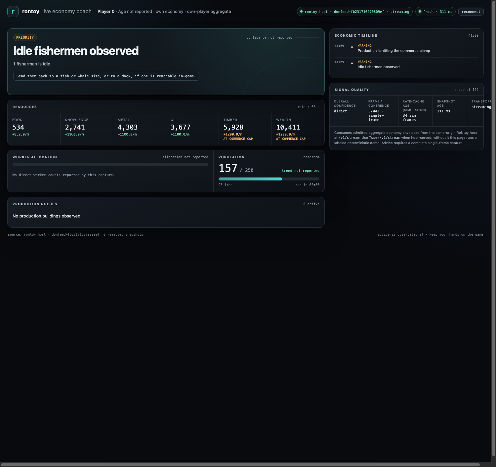
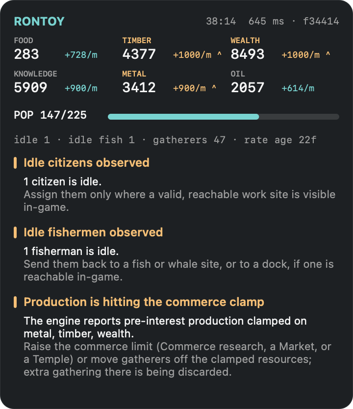

# rontoy-live — the pipeline is up, the gate is passed, the coach speaks

Lane: `rontoy-live`. Written 2026-08-08 against the match Ember was playing at the time.

## What a human can now do that they could not before

1. **Run one command and get a live coach.** `python3 tools/rontoy-host/rontoyctl.py up --open`
   starts the loopback host, launches the probe in the VM, feeds the host continuously, and
   opens the dashboard. No token to copy, no second terminal, no `prlctl` incantation.
2. **See the browser client rendering the real game.** The gate that had never been passed is
   passed: `web/public/rontoy.html`, served by the host, streamed live off the running match.
   
3. **Get actual advice.** The advice engine went from **zero advice on every live observation**
   to three rules firing continuously, including the one that matters most in a real RoN game:
   *your production is hitting the commerce clamp and the surplus is being thrown away.*
4. **Put that on top of the game.** `tools/rontoy-overlay/build.sh` builds a topmost,
   click-through card that hugs the Parallels window and updates twice a second.
   
5. **Record a match and replay it into the same dashboard.** `up --record x.ndjson`, then
   `replay x.ndjson --hold --open`. The recording is a usable regression fixture.

## 1. The transport, fixed

The capture half was already proven; the wiring was the problem. The token was generated per
run and printed to stdout, and there was no supported way to *read* it.

* `server.py --token-file PATH` publishes the ephemeral token at mode 0600 and deletes it on
  exit. `bridge.py --token-file PATH` consumes it. Neither the host nor a collector needs the
  token to pass through a human's clipboard.
* `--token`, and `RONTOY_TOKEN` for both host and bridge, pin a token instead of generating
  one. An empty value is refused rather than silently treated as "generate one" — an empty
  `RONTOY_TOKEN` is far more likely to be a broken pipeline than an intent.
* **`tools/rontoy-host/rontoyctl.py`** is the supervisor. `doctor` reports readiness and
  changes nothing (VM running, guest probe present, game running, no stale probe, port free,
  dashboard asset present). `up` runs the host in-process, publishes the token, launches
  `donfeed` in the guest via `prlctl exec`, pumps its stdout through the *same*
  `normalize_donfeed_observation` → `POST /v1/snapshot` path the manual bridge uses, prints a
  one-line live status, and on exit terminates the guest probe and prints a run summary.
  `replay FILE` does the same from a recording, with no game required.

The HTTP hop is kept on purpose: it is the admission boundary under test, so a supervised run
and a hand-run bridge exercise identical validation, rate limiting, and rejection accounting.

The host's per-request access log is suppressed in a supervised run (`--verbose` restores it),
because it interleaved with the status line and hid the numbers that matter.

## 2. The live gate

```sh
python3 tools/rontoy-host/rontoyctl.py doctor
python3 tools/rontoy-host/rontoyctl.py up --hz 1 --seconds 600 --record live.ndjson
```

Three supervised runs against the live match, 1 Hz [measured]:

| run | lines read | admitted | host-rejected | dropped before the host |
|---|---:|---:|---:|---:|
| gate (200 s) | 201 | 201 | 0 | 0 |
| record A (~6.6 min) | 398 | 398 | 0 | 0 |
| record B, final code (10 min) | 601 | 600 | 0 | 1 |

Across the 999 recorded observations of runs A and B [measured]: **998 coherent (99.9 %)**,
0 short reads, 1 retry (which is the coherence algorithm working — that capture shows 50 reads
instead of 25), `valid_components` 25/25 on every coherent capture, module sha256
`30478a44…625079` throughout, frame counter monotone within each session.

The single non-coherent observation is the fail-closed path working, live and unprompted: at
frame 39,282 the probe reported `coherence: "unavailable"`, `valid_components: 1`, and the
note *"console leader slot 0 changed identity (flags=0x3707, who=0)"*. It emitted no economy
reading, the host never saw it, and the dashboard kept the previous snapshot and its age rather
than showing a zero-filled leader. Worth chasing separately: what makes the console leader's
flags read `0x3707` for one sample when they are otherwise stable.

Probe-side capture cost, as reported by `donfeed` itself: median **64 µs**, p95 **138 µs**,
max **546 µs** — three orders of magnitude under one 67 ms simulation frame. That is the cost
of the read, **not** an observer-effect measurement; the alternating probe-on/probe-off pacing
study the track doc specifies has not been run and remains open.

The browser gate was driven through Chrome DevTools rather than eyeballed, so it can be
re-run: the page's own `window.rontoy.stats()` reported `mode: "sse"`,
`source: "rontoy host · donfeed-fb231716270809ef"`, `transport: "streaming"`, sequence 194,
0 rejected, and its rendered DOM carried the live stockpiles, `157 / 250` population, and the
clamp markers. Script at `/private/tmp/.../shotdir/shot.py` (scratch; not committed).

## 3. Why the advice engine said nothing

**Verdict: it is not that the rules are too conservative. Three of the four rules were
structurally unreachable, because the normalizer threw away every field they read.**

`normalize_donfeed_observation` carried exactly six stockpiles, six income rates, population
used/cap, and the rate-cache stamp. Everything else in the observation was dropped on the
floor: `free_peasants`, `idle_fishermen`, `gatherers`, `fishermen`, `peasants`, `scholars`,
`over_cap[6]`, `resource_cap_x16[7]`, `gross_x16`, `support_x16`, `city_num`, `score`,
`gather_slots`, `filled_gather_slots`, `leftover`, `epoch`, `age`.

So of the advisor's four rules:

| rule | why it never fired |
|---|---|
| `idle_citizens_observed` | reads `population.idle_citizens`; the schema has the slot, the normalizer never filled it |
| `population_pressure` (headroom ≤ 0) | reachable, but the sample had 14 headroom |
| `population_headroom_low` (headroom ≤ 2) | reachable, but the sample had 14 headroom |
| `goal_bottleneck_*` | needs caller-supplied `goals`; neither `bridge.py` nor any collector supplies any |

There is a second, weaker effect worth recording: even with goals supplied, the rate-dependent
gate `income_rate_too_old_for_eta` (45 frames) fires routinely on a live feed. The first live
dashboard render measured a gather-cache age of **516 frames**. The README already flags this
cutoff as deliberately conservative; the live measurement says it will hide ETA most of the
time, and picking a real threshold needs a distribution of `gather_stamp` update intervals.

### What it says now

Advisor version 2. The normalizer now carries three direct-counter blocks — all values the
engine maintains, none computed by us:

* `economy.population.idle_citizens` ← `LeaderData::free_peasants` (`+0x9BC`), the engine's
  own fast idle-citizen counter, per `docs/derivation/rontoy-econ.md`.
* `economy.workers` — `gatherers`, `peasants`, `fishermen`, `idle_fishermen`, `scholars`, with
  `basis: "direct_leader_counters"`. **`filled_gather_slots` is deliberately excluded**: slot
  occupancy is site capacity, and the track doc is explicit that it must never be presented as
  worker allocation.
* `economy.clamp` — per resource, the engine's `over_cap` status and `cap_per_min`
  (`resource_cap` x16-per-30-game-seconds ÷ 8). `over_cap` outside `{0,1,2}` fails the capture
  closed instead of producing advice.

Three new/enabled rules: `idle_citizens_observed`, `idle_fishermen_observed`,
`income_clamped_pre_interest`.

I did **not** implement the tempting `over_cap == (income > cap)` shortcut. On the first live
sample that relation held on all six resources, which is exactly how you talk yourself into a
wrong formula. `docs/derivation/rontoy-econ.md` derives it from code as
`over_cap[r] = 0 if pre-interest income ≤ cap, else 1 + (resource_cap[r] > 0x3E6F)`, and warns
that post-clamp interest can push *displayed* income above the cap while `over_cap == 0`. The
host carries the engine's byte and never recomputes it.

Replayed over the 127-observation recording [measured]: **0 advice events before, 358 after** —
`idle_citizens_observed` on 104, `idle_fishermen_observed` on 127, `income_clamped_pre_interest`
on 127, with the clamped set moving from `{metal, timber, wealth}` to
`{food, metal, timber, wealth}` mid-recording.

The dashboard picks all of this up: `pop.idle_citizens` already fed its worker panel, the new
rules already flowed into its headline card and timeline, and `web/public/js/rontoy.js` now
carries the clamp status onto the resource chips ("AT COMMERCE CAP"), validating it as an
integer in 0..2 like every other field it admits.

44 host tests green, including four new ones that name each previously-unreachable counter and
one that proves an impossible `over_cap` fails closed.

## 4. The overlay

`tools/rontoy-overlay/RoNtoyOverlay.swift`, built and audited by
`tools/rontoy-overlay/build.sh`.

**Mac-side, not guest-side, and the reason is measured, not assumed.** `prlctl exec` runs as
SYSTEM in Windows session 0. Asking it for the game's window gives
`MainWindowHandle = 0` for pid 5236 while the game is plainly visible on Ember's screen —
session-0 isolation. Any window a session-0 process creates lands on an invisible desktop. A
guest-side overlay would require starting a GUI process inside Ember's interactive session,
which our access path cannot do. The Mac side has no such problem, and it is also the stronger
read-only story: the overlay is not merely outside the game's process, it is outside the game's
*operating system*.

**Fullscreen-exclusive was never the binding constraint here.** Measured from
`CGWindowListCopyWindowInfo`: Parallels Desktop is a normal `layer=0` window (1528×1072), so
the overlay composites above it like any other Mac window. The window also carries
`.canJoinAllSpaces` and `.fullScreenAuxiliary` so Parallels' full-screen mode is covered. The
one case that genuinely cannot be drawn over — a fullscreen-exclusive D3D surface — does not
arise while the game lives inside a VM window.

**Read-only, enforced at build time.** `build.sh` fails if the linked binary references any
input-synthesis (`CGEventPost`, `CGEventTapCreate`), accessibility-control (`AXUIElement*`),
foreign-memory (`task_for_pid`, `mach_vm_*`), or screen-capture (`CGWindowListCreateImage`,
`SCStream*`, `CGDisplayStream`) symbol. The audit was mutation-tested: with `NSURLSession`
substituted into the forbidden set it fails, so it bites. The binary's entire outside contact
is `NSURLSession` to `127.0.0.1` and `CGWindowListCopyWindowInfo` for window bounds — the
latter needs no permission and returns no pixels.

**Placement is verified from outside the process** [measured]: while running, the window list
shows `rontoy-overlay layer=1000` at `1204,77 360×346` inside `Parallels Desktop layer=0` at
`54,59 1528×1072` — the requested top-right corner with an 18 px margin. It re-anchors each
poll, and did so correctly after Ember moved the VM window mid-session.

`ignoresMouseEvents = true` and `NSApplication.setActivationPolicy(.accessory)` mean it can
never be clicked, dragged, focused, or appear in the Dock. The cost is real and stated in its
README: there is nothing to click, so every setting is a launch flag.

**What I could not capture:** a screenshot of the composited screen. `screencapture` is
refused — Screen Recording permission is not granted to this terminal, and asking for it is
Ember's call, not mine. The overlay's own `--snapshot` renders the card through
`bitmapImageRepForCachingDisplay`, which captures our view and nothing else; that PNG plus the
window-list geometry is the evidence, and it is weaker than a composited screenshot in exactly
one way: it shows the card is drawn correctly, not that a human's eyes see it over the game.

## Files this lane wrote

| path | what |
|---|---|
| `tools/rontoy-host/rontoyctl.py` | new — doctor / up / replay supervisor |
| `tools/rontoy-host/rontoy_host.py` | token file + env, quiet access log, three direct-counter blocks, two new rules |
| `tools/rontoy-host/bridge.py` | `--token-file`, shared token resolution |
| `tools/rontoy-host/test_rontoy_host.py` | 6 new tests (44 total, green) |
| `tools/rontoy-host/README.md` | one-command flow, token ergonomics, new schema blocks |
| `tools/rontoy-host/.gitignore` | ignore the token file and recordings |
| `tools/rontoy-overlay/RoNtoyOverlay.swift` | new — topmost click-through overlay |
| `tools/rontoy-overlay/build.sh` | new — build + forbidden-symbol audit |
| `tools/rontoy-overlay/README.md` | new |
| `web/public/js/rontoy.js`, `web/public/rontoy.html` | clamp status on resource chips |
| `docs/tracks/img/rontoy-live-*.png` | live evidence |

## Open

* **The 30-minute R1 gate is not passed.** The longest single supervised run was 10 minutes.
  The coherence bar (≥99 %) is cleared at 99.9 % over 999 observations, but the duration bar is
  not, and it should be one continuous 30-minute active match, not a sum of sessions.
* **The observer effect is unmeasured.** Probe cost (µs per capture) is not slowdown. The
  alternating probe-on/probe-off pacing study with a predeclared non-inferiority margin has not
  been run, and until it is, "no measurable effect on the game" must not be claimed.
* **The 45-frame rate-age cutoff needs a real threshold.** Measured live ages reach 516 frames.
  Collect the distribution of gather-cache update intervals and pick from it.
* **HUD differential still not done.** Every number here agrees with itself; none of it has
  been compared against what the game draws on screen. That is the check that could actually
  falsify the economy decode, and it needs Ember at the keyboard.
* **Multiplayer suppression, pause, restart and source-loss paths are untested live.** The code
  paths exist and have unit tests; no live match has exercised them.
* **No production/queue data.** `economy.production` remains unfilled: the live aggregate
  attacking-unit counters are not producer queues and must not be mapped to `queue_depth`.
* **The overlay is not signed or bundled**, so it cannot be launched from Finder, and it has no
  hotkey (a hotkey would need an event tap, which the read-only promise forbids).
* **`goals` are still never supplied by any collector**, so `goal_bottleneck_*` remains dead in
  practice. It wants a plan source — the opening optimizer is the obvious one.
