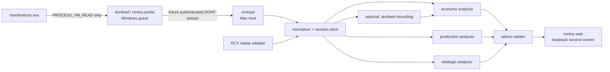

# RoNtoy — read-only live coaching for Rise of Nations

Status: **attach-ready R1 prototype; live retail acceptance still pending**. A read-only
Windows `donfeed` binary, strict Mac bridge/host, and same-origin browser dashboard now form a
golden-tested vertical slice. It has not yet been deployed into a fresh match or passed the
HUD differential, restart/fault, multiplayer-suppression, pause, and 30-minute observer-effect
gates below, so it is not yet a proven live product.

This track treats RoNtoy as a first-class product, not a debugging panel bolted onto
`donscan`. Its first useful form is a local second-screen economy coach for a solo game. Its
long horizon is a calibrated coach that can explain production and strategic decisions from
the same evidence base as `don-sim` and `don-ai`.

## Product promise

During a match, RoNtoy answers four questions without controlling the game:

1. **What is true now?** Stockpiles, net income, commerce headroom, population, queues,
   worker allocation, production utilization, and the observations' freshness.
2. **What is about to go wrong?** Population blocks, idle production, capped income,
   unaffordable near-future plan actions, exposed expansions, and resource imbalances.
3. **What should I consider doing next?** One or two timely actions, with the expected
   benefit, time horizon, confidence, and evidence visible.
4. **Why did it say that?** Every recommendation links to the observed fields and a
   versioned analysis rule or model. RoNtoy never presents a guess as a retail-derived fact.

The product is **read-only**. It does not call `WriteProcessMemory`, inject a DLL, install a
hook, synthesize keyboard or mouse input, issue game orders, change game speed, or bypass an
anti-cheat system. Advice ends at the human.

## Current evidence and blockers

- `crates/donscan` now fingerprints the exact supported executable, uses query/read-only
  process rights, selects one unique console human, reads only leader-economy fields, and
  drops snapshots unless the Game, mode, pause, human, encrypted-pointer, and frame guards
  remain coherent. It emits no enemy, object, or map telemetry in R1.
- The Rust encoder's redacted NDJSON golden is consumed by the real Python bridge, admitted by
  the host, streamed over SSE, and rendered by Chrome. Reader tests, host tests, malformed/XSS
  browser smoke, and the Windows cross-build/import audit are green.
- [`../derivation/rontoy-econ.md`](../derivation/rontoy-econ.md) records the exact economy
  chain and masks, population correction, cache-age semantics, queue caveat, and live witnesses.
- The current normalized R1 surface is intentionally narrow: six stockpiles, direct cached
  HUD rates plus their age, population/cap, build/process identity, SP/MP and pause evidence,
  and capture health. It does not yet transport cap state, cities, worker assignments, or
  trustworthy per-producer queues.
- The remaining blocker is empirical: deploy the new binary in a controlled match, compare
  every displayed signal with the HUD, prove multiplayer and pause suppression, exercise
  restart/source-loss/torn-frame paths, and measure the observer effect at 1/5/15 Hz. Start at
  1 Hz.

## Architecture and transport boundary

The **frozen, tested R1 path** is:

```text
donfeed.exe rontoy.observation v1 NDJSON
  -> tools/rontoy-host/bridge.py
  -> Python snapshot v1 / latest-only SSE
  -> host-served rontoy-web
```

`rontoy-proto` (`DONF`) and `rontoy-core` are tested R2 foundations, not participants in that
live path yet. Migrating R1 to them requires one owner, an explicit field mapping, a
cross-language golden, and a deprecation/version plan; neither contract should be called the
current canonical transport until that integration lands.

The longer-term architecture remains:



Suggested code/ownership boundaries:

| Component | Owns | Must not own |
|---|---|---|
| `rontoy-memory` | platform-independent `Mem` parsing, retail offsets/manifests, synthetic memory fixtures | Windows handles, sockets, advice |
| `rontoy-protocol` | `DONF` records, encoder/decoder, compatibility and golden vectors | retail pointers/offsets, analysis policy |
| `rontoy-probe` | Windows process identity/handle, coherent capture loop, source filtering, outbound transport | host HTTP, browser assets, advice |
| `rontoy-core` | normalized `Observation`, history, signals, advisor lifecycle/provenance | `ReadProcessMemory`, UI rendering |
| `rontoyd` | authentication, session store, recording, loopback HTTP/event stream | retail decoding and recommendation formulas |
| `rontoy-web` | dashboard, speech, interaction and post-game review | raw memory addresses, hidden state, rule truth |

The existing untracked `crates/donscan/src/live.rs` and `donscan` library/binary entrypoints
are collision hotspots. One designated integrator should own their adoption or extraction,
the root workspace membership, and protocol wiring. Parallel lanes should work behind the
contracts above rather than each editing `donscan/src/lib.rs`, `main.rs`, or its manifest.
The MVP does not depend on `don-sim` or the opening optimizer at runtime; those models become
optional analyzers only after their omissions are represented in confidence and validation.

### `rontoy-probe`: small and process-facing

The Windows probe owns process discovery, build identification, targeted
`ReadProcessMemory`, snapshot coherence, retail-to-wire decoding, and source-side filtering.
It must not contain advice rules or a web server.

It opens the process with only the access necessary to query identity and read memory. A
static import audit must show no write, injection, remote-thread, input-synthesis, or global
keyboard-hook APIs. The probe connects **outbound** to the host; it does not expose an
inbound port in the guest.

Slow-changing data uses keyframes:

- executable/build identity once per session;
- optional type dictionary once, and again only when its digest changes;
- optional terrain/territory map at session start and on an explicit dirty signal or
  low-rate poll, after the visibility gate exists;
- leader state at the configured sample rate, with live objects only when that optional
  capability has passed its separate validation gate.

The initial product rate is **2 Hz**. Economy decisions do not need 15 Hz, and the known
Parallels/`ReadProcessMemory` behavior makes reliability more valuable than a tactical-looking
number. Five to fifteen hertz is a later tactical gate, not a launch claim.

### `rontoyd`: normalize once, analyze many ways

The host daemon accepts one authenticated probe, validates and records the raw feed if the
user opted in, normalizes engine-specific records into product observations, runs analyzers,
and serves the loopback UI. No browser receives raw process addresses or hidden opponent
state.

The normalization boundary is important: live memory, `.donfeed`, `.rcx`, and synthetic test
fixtures all produce the same `Observation`. An analyzer cannot tell which transport supplied
it and therefore cannot quietly depend on a process-memory accident.

Conceptual Rust interfaces:

```rust
pub trait ObservationSource {
    fn next(&mut self) -> Result<Observation, SourceError>;
}

pub trait Analyzer {
    fn id(&self) -> &'static str;
    fn update(&mut self, now: &Observation, history: &History) -> Vec<Signal>;
}

pub trait Advisor {
    fn reconcile(&mut self, now: &Observation, signals: &[Signal]) -> Vec<AdviceEvent>;
}
```

`ObservationSource` may report a gap or discontinuity. It must never fabricate an empty
snapshot on a failed read.

### `rontoy-web`: second screen first

V1 is a browser dashboard on the Mac beside the Parallels game. That avoids injection,
exclusive-fullscreen problems, and Windows overlay fragility. A transparent always-on-top
window may come later, but it consumes the same loopback API and still does not hook the
game.

## R2 versioned telemetry: `.donfeed` / `DONF`

The interrupted `DONL v1` is not a stable contract and must not be repaired in place while
retaining the same version. `crates/rontoy-proto` defines a new `DONF` file/stream envelope
for the planned R2 migration; the frozen R1 NDJSON/Python path above remains the only wired
vertical slice today.

### Compatibility rules

- The future outer stream is length-prefixed little-endian binary. After R2 migration,
  NDJSON remains a debug/export view rather than the canonical live transport.
- A file header identifies `DONF`, schema major/minor, session UUID, source build
  fingerprint, and creation time. Each record has a type, length, sequence, and integrity
  check so a truncated recording is detectable.
- A frame contains a directory of independently versioned sections. Unknown section IDs are
  skipped by byte length. Known fixed-stride sections are skipped by `count * stride` when a
  newer minor version appends fields.
- A major version changes only for incompatible meaning. Minor versions may add sections,
  append fields, or define previously reserved bits; they never change an existing field's
  unit or interpretation.
- Integers remain in retail units on the wire. For example, economy income stays in
  sixteenths per gather period, and object coordinates stay in fine world units. Display
  conversion happens in the host.
- Unavailable data is expressed by section/field validity, not a plausible zero.

Required frame metadata:

```text
session_id, capture_seq
source_build_fingerprint, pid, process_start_id, image_base
monotonic_capture_ns, capture_duration_us
frame_start, frame_end, coherence, retry_count
component_validity, capability_bits
read_calls, bytes_read, short_reads, decode_errors
```

`coherence` is one of `coherent`, `paused`, `incoherent_dropped`, or `source_lost`.
Only `coherent` and deliberately detected `paused` frames enter analyzers.

Required V1 sections:

| Section | Required fields | Notes |
|---|---|---|
| `LeaderV1` | slot/in-play/team/nation, score, population/cap, cities, stockpile `[6]`, gross `[6]`, support `[6]`, net income `[6]`, cap `[7]`, over-cap status `[6]`, age and library epochs; `gather_stamp` and derived cache age; direct `free_peasants`/`gatherers`; engine-maintained `num_units`, `num_buildings`, `num_queued[806]`, and barracks/stable/factory/combat/dock/air queued counters | Read `LeaderDataEncrypt` through its pointer and decode each encrypted field with its measured mask. Direct aggregate fields retain per-field validity until independently checked live. `gather_stamp` makes stale cached income visible. |
| `HealthV1` | effective sample rate, drops/retries, last coherent frame, source capabilities | Always visible in the UI. |

Optional capability-gated sections:

| Section | Fields | Gate |
|---|---|---|
| `ObjectV1` | stable key, owner, band/kind/type, position, HP/max HP, flags | Independent liveness, HP, identity, and source-filter differential tests. Not required for R1 or R2. |
| `TypeDictionaryV1` | type index, internal/display names, class, static costs/times/stats, provenance digest | Exact loaded-data/build digest and golden decode. Static data may instead be loaded on the host for the economy slice. |
| `MapV1` | dimensions, terrain class, territory, observation/visibility mask | Independent visibility derivation and a test proving hidden state cannot leave the probe. Not required for R1 or R2. |

The stable object key is `(session_id, owner_slot, band, object_index, uid, birth_seq)`.
`addr` is not identity, and `(object_index, uid)` may be reused after death. The normalizer
increments `birth_seq` when a slot is reused or its identity changes after absence.

V2 sections needed for production coaching:

```text
OrderV1 { object_key, state, order_type, target_key?, target_pos?, started_frame }
QueueV1 { producer_key, queue_index, type_index, count, progress, paused, blocked_reason? }
GatherV1 { unit_key, resource, source_key?, city_key?, carrying, assigned }
ResearchV1 { producer_key, tech_type, progress, completion_frame_estimate? }
```

Every nullable value has an explicit presence/validity bit. Estimates are never encoded as
observed retail fields.

### Coherent capture algorithm

For each attempt:

1. Read the process identity, root pointers, and `Game::frame` as `frame_start`.
2. Read the targeted required component blocks, coalescing adjacent ranges. Read optional
   object/type/map sections only when their advertised capability is enabled.
3. Re-read the roots and frame as `frame_end`.
4. Accept only when the process identity and roots are unchanged, all required reads are
   complete, and `frame_start == frame_end`. Otherwise discard the attempt and retry within
   a fixed budget.

A partial optional section may be omitted while the leader frame remains valid, because
section validity is independent. A partial leader block may not be emitted as a zero-filled leader.
After the retry budget is exhausted, emit a health event and no observation.

## Analysis model

The analyzer is event-sourced over coherent observations. It derives rates over windows,
detects stable entity births/deaths, tracks advice resolution, and resets history whenever
the session/build/process identity changes or frames regress.

### Economy signals

The first analyzer should calculate:

- exact displayed and post-support income by resource;
- commerce-cap headroom and the retail `over_cap` status (`0`/`1`/`2`). That status does not
  state an exact waste magnitude; exact discarded income is unavailable until pre-clamp
  `base_rate[6]` and the relevant civilization, wonder, interest, and other modifier semantics
  are captured or faithfully recomputed;
- stockpile slope over 5-, 15-, and 30-second windows, separated from the instantaneous
  retail income field;
- time to afford each **unqueued candidate** action, with `unknown` when its costs or income
  inputs are incomplete. Retail generally pays an item at enqueue, so an existing live queue
  is not described as “waiting to afford” its own cost;
- population headroom and forecast time to a population block;
- worker allocation, idle gatherers, unsupported/oversaturated sources, and builder
  opportunity cost once `GatherV1` exists;
- resource imbalance relative to the selected plan, current queues, or a neutral
  age-up/expansion basket;
- market/caravan/city capacity and the value of an additional commerce action using the
  measured mechanics.

The live values and the model stay separate. “Food income is capped” is an observation.
“Research Barter now” is a model recommendation. The analytics work already contains a
valuable warning: the shipped opening is a strict local optimum under the tested one-edit
perturbations, and the earlier Barter-first recommendation was backwards. RoNtoy must run
such recommendations through captured regressions, not rediscover folklore with a dashboard.

### Production signals

- producer utilization and idle intervals;
- empty-queue starvation, completion forecast, and overlapping production capacity;
- population or execution blocks attributable to a specific live queue. A resource block is
  claimed only when retail exposes that state; otherwise affordability applies to the next
  unqueued candidate action;
- ramped cost/time for the next unit or building, using owned-plus-queued counts where
  retail does;
- build/research critical path for the active plan;
- citizens removed from gathering while constructing;
- missing enabling buildings/techs, with a dependency chain rather than a generic warning.

### Strategic signals

Strategic coaching starts only after the relevant observation is both visible to the player
and derived well enough to explain:

- military/economy balance and reinforcement production;
- attack exposure around cities and economic infrastructure;
- expansion opportunity, city-pair caravan capacity, and territory tax opportunity;
- composition warnings tied to observed opposing units;
- map-control and scouting gaps based only on legitimate visibility;
- timing windows produced by the same build-order/economy model used offline.

No V1 “strategy score” should collapse these into an opaque number.

## Advice contract: confidence and provenance are data

An advice event has a stable lifecycle, not just text:

```rust
pub struct AdviceEvent {
    pub id: AdviceId,
    pub analyzer_id: String,
    pub rule_version: String,
    pub observation: (SessionId, u64), // session + capture_seq
    pub status: AdviceStatus,          // raised, updated, resolved, expired, retracted
    pub priority: AdvicePriority,
    pub horizon_frames: Option<u32>,
    pub expires_frame: Option<u32>,
    pub title: String,
    pub action: String,
    pub rationale: String,
    pub expected_effect: Option<String>,
    pub evidence: Vec<EvidenceRef>,
    pub confidence: Confidence,
}
```

`EvidenceRef` points to a telemetry field, its value, capture sequence, age, and provenance.
The rule itself points to a versioned implementation plus the binary/data addresses or
model report that justify it.

Confidence is a tuple, not a decorative percentage:

| Facet | Values |
|---|---|
| input quality | coherent / stale / partial / invalid |
| evidence tier | retail-observed / binary-derived / data-derived / modelled / heuristic |
| coverage | which required inputs were present |
| calibration | uncalibrated / fixture-tested / replay-tested / outcome-calibrated |

The UI may summarize the tuple as **high**, **medium**, or **experimental**, but it must expose
the facets. A numeric “91%” is forbidden until its calibration set and scoring rule exist.

The advice arbiter prevents coaching spam:

- one spoken headline at a time and at most one ordinary spoken item per 15 seconds;
- critical items may preempt, but repeated state refreshes update one card rather than create
  duplicates;
- threshold hysteresis and per-rule cooldowns prevent flapping;
- stale, incoherent, or source-lost observations suppress recommendations and produce a
  visible data-health state;
- a recommendation resolves when its condition clears, expires when its action window
  closes, and retracts when later evidence invalidates it.

## UI and interaction

The match view has four regions:

1. **Economy ribbon:** six stockpiles, net rates, cap utilization, and short trend. A cap or
   negative trend uses color plus an icon/text label, never color alone.
2. **Now card:** the single highest-priority action, “why now,” expected benefit, expiry,
   and confidence. Expanding it shows exact evidence and provenance.
3. **Production lanes:** each city/producer's current work, queue, utilization, and predicted
   completion/block reason.
4. **Timeline:** raised/resolved advice, age/tech/city milestones, source gaps, and bookmarks.

Optional browser speech reads only the title and short action. The player can mute, snooze a
rule, switch between `quiet`, `coach`, and `lab` density, or bookmark a moment for post-game
review. Speech failure never affects capture.

Post-game mode replays the same observation/advice stream, lets the player inspect why a card
appeared, and compares actual outcomes with its prediction. This is how RoNtoy becomes
calibrated rather than merely opinionated.

## Privacy, fair-play, and operational safety

- The default build accepts **solo, tutorial, replay, and explicitly marked disposable
  developer matches**. Live multiplayer coaching is disabled until the project's policy and
  the relevant community/platform rules have been reviewed.
- The R1/R2 economy slice captures **no object, enemy, or map data**: only the selected
  leader's direct state and aggregates. Object/map capability remains disabled until
  visibility filtering is independently derived and tested. Hidden enemy objects are never
  transmitted, recorded, analyzed, or displayed by the coaching default. An omniscient
  developer mode, if ever needed for validation, requires an explicit separate flag and a
  permanent red watermark; it is not packaged as the coaching default.
- The host service binds the browser API to `127.0.0.1`. Probe-to-host traffic uses the
  Parallels host-only network, a per-run random 256-bit token, origin-independent binary
  framing, and a single active-probe policy. No cloud endpoint exists in V1.
- Recording is off by default. Opt-in `.donfeed` files exclude process addresses, player
  names, Steam identifiers, chat, and unrelated memory. Retention is explicit and local.
- Diagnostics contain schema/build IDs, counters, and bounded error messages—not memory
  dumps. Raw memory capture is a separate developer command with a conspicuous destination.
- The probe runs in the foreground with a parent/session token and exits on disconnect. No
  scheduled task, autorun entry, service, or hidden background process is installed.
- Source loss, version mismatch, short reads, and build mismatch fail closed: the UI says
  **feed unavailable** and gives no advice.

## Deployment shape

Release artifacts:

```text
rontoy-probe.exe     ARM64 Windows, zero/minimal dependencies, embedded build manifest
rontoyd              arm64 macOS host daemon + analyzers
rontoy-web/          static local application
rontoyctl            doctor/start/stop/record/replay commands
```

`rontoyctl doctor` verifies the game build, VM reachability, exact probe hash, guest process
state, stale `DONRoN` task absence, host-only route, ports, and schema compatibility without
attaching. `rontoyctl start --player <slot>` starts the loopback server, creates a one-run
token, transfers/hash-verifies the probe when necessary, and launches it in the guest as a
foreground process. `rontoyctl stop` names and terminates only the processes it started.

The probe and host publish their build IDs in every session. A source build not in the
offset manifest is rejected rather than “mostly working.” Offset manifests are keyed by a
cryptographic executable fingerprint, not by a human version string.

## Validation strategy

### Capture and wire

- Synthetic sparse-memory tests cover null roots, short reads at every boundary, stale/free
  slots, XOR decoding, object identity reuse, frame changes, pointer changes, build mismatch,
  and all section-validity combinations.
- Every encoder has an independent decoder and byte-level golden vectors. Mutating magic,
  version, length, stride, count, integrity value, or a required validity bit must fail.
- Compatibility tests require an older reader to skip new optional sections and a newer
  reader to consume every committed V1 fixture.
- A forced mid-capture frame increment must cause a retry/drop, never a published mixture.
- Import inspection proves the release probe contains read/query/network/time APIs but none
  of the prohibited write/injection/input APIs.

### Live differential checks

All first attaches happen in a disposable solo skirmish after the stale task/process audit.
Captured values are compared against independent game surfaces or known state changes:

- stockpiles and displayed income against the HUD, applying only the retail-documented
  display rounding;
- population/cap/city count against the HUD;
- direct leader unit/building/queued aggregates against controlled creation, enqueue,
  cancellation, completion, and death;
- cap flags against a deliberately saturated resource;
- once the optional object capability is under test: unit/building HP, queue/progress, and
  stable identity across movement and replacement of a destroyed/rebuilt slot.

Expectations are captured from the game or a saved feed, never hand-calculated. The harness
must include a mutation that proves each comparison can fail.

### Advice

- Each rule owns deterministic timeline fixtures for `raise`, `update`, `resolve`, `expire`,
  `retract`, cooldown, hysteresis, and missing-input suppression.
- Scripted solo scenarios deliberately trigger population block, commerce cap, idle producer,
  idle gatherer, empty queue, and unaffordable unqueued candidate advice. A screen/video and
  feed timestamp provide the independent observation.
- Replay and recorded-feed backtests report advice frequency, duplicate rate, lead time,
  resolution, and missing-data suppression per rule. They do not claim the advice is good
  merely because it fired.
- Outcome calibration begins only when an advice prediction has a measurable outcome and a
  defined comparison. Until then its calibration facet remains `uncalibrated` or
  `fixture-tested`.

### Performance and observer effect

The initial 2 Hz gate is:

- at least 99% of published observations coherent during a 30-minute active solo match;
- no frame regressions within one session, and every discontinuity explicit;
- targeted capture p95 below one 67 ms simulation frame, with bytes/read calls reported;
- observer effect measured on the same reproducible save, speed, camera, and input script in
  alternating probe-on/probe-off trials. Compare game-frame advance against monotonic time,
  report median/tail pacing and confidence intervals, and require the slowdown's upper
  confidence bound to remain below a predeclared non-inferiority margin chosen after baseline
  variance is measured—neither replay throughput nor a naive single-run 1% comparison is an
  acceptable substitute;
- host analysis and UI may lag, but they discard superseded frames rather than queueing an
  ever-growing backlog; displayed observation age stays below one second at p99.

These are acceptance thresholds to measure, not current performance claims.

## Phased definition of done

### R0 — contract and safe skeleton

- `DONF` schema, independent decoder, golden frames, compatibility policy, and malformed-input
  tests exist.
- `rontoyctl doctor` reports the old `DONRoN` task and all matching processes without changing
  them; cleanup is explicit and target-specific.
- The probe's access/import audit is green.
- Synthetic coherent capture proves frame/pointer changes are dropped.

**Done means no attachment is needed to prove the safety and wire invariants.**

### R1 — trustworthy live telemetry

- Correct the 68/64 header defect by replacing, not silently revising, `DONL v1`.
- Read and decode `LeaderDataEncrypt` through `Leader + 0x6EB8`; add `gather_stamp`, cache
  age, free-peasant/gatherer, and direct unit/building/queue aggregates; add frame/root guards
  and explicit per-field validity.
- Emit no object, enemy, or map state. Build/wall HP, object type identity, and visibility
  stay quarantined behind a later optional capability rather than delaying the economy feed.
- Land the Windows executable/feed path and run the complete focused test suite plus the root
  workspace gate.
- Pass the 30-minute disposable-game coherence/performance gate and HUD differential checks.
- Record and replay the same `.donfeed` with byte-identical normalized observations.

**Done means RoNtoy can be trusted as an instrument even if it gives no advice.**

### R2 — economy dashboard

- Show six correct stockpiles, exact net/display income, cap headroom/status, gather-cache age,
  trends, population/cap, cities, direct aggregate counts, observation age, and health at 2 Hz.
- Leader/static-data state survives reconnect and a process restart starts a new session;
  object/map keyframes are not an R2 dependency.
- UI is useful at laptop width, keyboard navigable, color-independent, and remains responsive
  during a 30-minute recording.

**Done means the player can replace periodic HUD arithmetic with a trustworthy glance.**

### R3 — active economy advice

- Land `OrderV1`, `QueueV1`, `GatherV1`, and the first five rules: imminent population block,
  income-at-cap status, idle producer, idle gatherer, and empty queue or candidate-action
  affordability. Do not report an already-paid live queue as resource-starved.
- Every card supplies evidence, rule version, confidence facets, expiry, and lifecycle.
- Speech/cooldowns/hysteresis pass deterministic timeline tests; invalid or stale telemetry
  produces zero gameplay advice.
- Controlled solo scenarios trigger and resolve all five rules, followed by recorded-feed
  backtests and manual usefulness review.

**Done means RoNtoy actively helps during a match without becoming a nag or pretending its
model is ground truth.**

### R4 — plan-aware production coach

- The player can select the shipped opening, a searched plan, or no plan.
- The analyzer compares actual milestones with plan ranges, explains the current critical
  path, and recomputes after deviations rather than insisting on an obsolete script.
- Ramped costs/times, builder opportunity cost, parallel producers, and prerequisites use
  the derived retail mechanics and carry provenance.
- Advice outcome predictions begin calibration against saved feeds.

**Done means the coach understands an opening as a changing plan, not a build-order timer.**

### R5 — strategic coaching and shared DON integration

- Visibility-safe enemy composition, scouting, threat, expansion, caravan, and timing signals
  are available with per-signal derivation/validation gates.
- Live feeds, replay feeds, and `don-sim` observations use the same normalized schema.
- RoNtoy recordings can become sanitized regression fixtures and analysis datasets without
  teaching `don-sim` that a live memory value is an implementation shortcut.
- Each calibrated rule reports its dataset, version, and outcome metric; learned models are
  shadow-tested before they can speak during a match.

**Done means RoNtoy is the human-facing analysis surface of DON while remaining independently
auditable and strictly read-only.**

## The first impressive slice

For the next suitable solo match, the target is deliberately product-shaped:

1. a coherent 2 Hz foreground feed from the exact supported executable;
2. a Mac browser showing correct stockpiles, net income, cap utilization, population, cities,
   feed health, and a rolling timeline;
3. only three spoken/advice rules at first—population block, income-at-cap status, and an
   aggregate idle-producer cue—so each can be validated from leader telemetry and trusted;
4. an opt-in `.donfeed` recording that replays through the identical dashboard after the
   match.

That is already RoNtoy, not a scanner demo. Orders, worker allocation, plan-aware advice, and
strategy then expand the observation schema and analyzers without replacing its safety,
coherence, provenance, or UX foundations.
